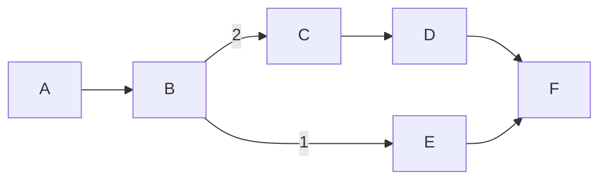
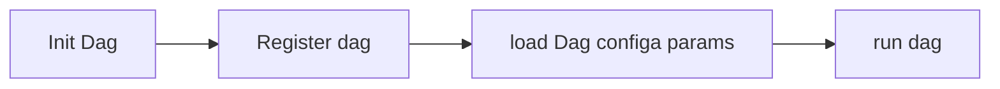

## Visage后端执行模块

Visage 后端执行模块(Execute)用于接收实验任务参数，执行实验任务并获取相关数据返回至前端页面。

Execute后端模块运行时为主进程的子进程，独立于Visge Gui主进程运行的后端进程，在Visage启动最初， Backend初始化之前启动。将Execute子进程方面Gui线程之前启动，主要有两点考虑：

1. Execute进程导包启动耗时较长，code版本需要2s左右，使用 `cxfreeze`打包后启动时间会增加至4-6s，部分机型·和环境时间会更一步加长，所以在主进程导报结束后率先启动子进程，节省后续时间；
2. 主进程在启动后会等待一段时间（预估Execute启动耗时）会定时查询子进程存活状态，而且在打包版本，如子进程在预估时间内为启动，有概率会导致主进程死亡；

### 进程通信

Visage 后端模块（Execute）与GUI主进程之间采用ZMQ做为通讯基础。Execute做为服务端，Backend 主动请求发送实验数据和控制指令。

* router-socket：
  * 下发实验任务；
  * 查询子进程状态；
  * 接收中断事件、关闭事件等指令；
  * 返回实验更新记录；
### 任务执行器

Visage中实验任务执行与 VIsage后端子进程的子线程中。采用这种方式执行实验任务有如下书店原因：

* 如果实验任务执行在GUI主线程， 任务执行时会阻塞页面导致页面闪退；
* 子进程的主线程需要做为服务端 ,实验只能通过子线程启动；

#### 执行任务线程

```python
class TaskThread(threading.Thread):

    def __init__(self,
                 service: zmq.Socket,
                 client: bytes,
                 params: Dict,
                 pair: zmq.Socket = None) -> None:
        threading.Thread.__init__(self)
        self.params = params
        self.service = service
        self.client = client
        self.protocol = TaskState
        self.records = None
        self.pair = pair
```

执行任务线程初始化的过程参数用途：

+ `records`参数用于返回单实验更新的实验参数；
+ `pair`参数用于在DAG任务中DAG更新的AG状态至主线程所用，亦可用于 `execute`和 `TaskThread`之间的双向通信。‘

TaskThread类run函数绑定 `execute`函数，该函数用于解析实验基础环境 `Experiment Context`,解析任务类型，配置实验执行参数，执行任务，最后获取更新记录并依据配置更新实验数据至 `Courier`数据库。

目前实验任务可分为两种，单次实验任务和DAG图遍历任务。

+ 单实验任务： 实验单元为 `monster`中实验
+ DAG任务： 实验单元为DAG图结构，至少包含一个单实验；

#### ExpExecutor(实验执行器)

ExpExecutor用于执行实验任务。

```

class ExpExecutor(RunOptions):
    """Experiment Executor class."""

    def __init__(self,
                 name: str = None,
                 params: Dict = None,
                 exp_path: Union[str, Dict] = None):
        """Initial `ExpExecutor` object."""

    @classmethod
    def from_dict(cls, data: Dict) -> "ExpExecutor":
        """From dict data create an Exp object.

        Args:
            data (dict): Create exp dict data.

        Returns:
            BaseDag: The dag object.
        """
        kwargs = {
            "name": data.get("exp_name"),
            "params": data.get("exp_params"),
            "exp_path": data.get("exp_params", {}).get("exp_path", None),
        }
        exp_obj = cls(**kwargs)
        return exp_obj

    def get_exp_cls(self) -> Any:
        if self._name in ExperimentMap:
            return ExperimentMap.get(self._name)
        else:
            if self._path:
                try:
                    developer_path = os.path.dirname(pyqcat_developer.__file__)
                    exp_file_list = os.listdir(developer_path)
                    exp_file_list = [
                        x.split(".", maxsplit=2)[0]
                        for x in (set(exp_file_list) - set(IGNORE_FILE))
                    ]
                    if self._path in exp_file_list:
                        exp_module_name = f"pyqcat_developer.{self._path}"
                        importlib.import_module(exp_module_name)
                        importlib.reload(eval(exp_module_name))
                        if self._name in dir(eval(exp_module_name)):
                            return getattr(eval(exp_module_name), self._name)
                except Exception:
                    logger.error("ExpExecutor load experiment failed")
                    return None
        return None
```

ExpExecutor可通过 `from_dict`实验参数生成：

+ name: 实验名称， 实验名称需与Monster实验名称或自定义实验类对应，否则无法查询到对应实验。
+ params: 实验参数，包含 `context`, `experiment_options` 和 `analysis_options` 。
+ exp_path: 实验路径，用于自定义实验寻找实验类；

执行实验首先通过 `get_exp_cls`获取到该实验的实验类对象， 自定义实现通过该接口从 `pyqcat_developer`获取实验类对象。然后通过 `deal_exp_options`函数递归解析下发的实验参数，将list和tupler转化为monster可接受的格式后执行实验，获取实验结果，根据实验质量更新参数值 `context`并生成参数更新记录。

#### 自动化流程

新版自动化采用图遍历，支持有向无环图，相较于autoflow的列表， 可增加更多的依赖关系和更复杂的自动化表征流程，并可以通过判断节点结果的质量判定是否继续执行或依据策略回溯节点来优化参数，尝试通过问题节点。

简单的有向无环图如下图，DAG可解决当某已节点存在多个依赖的关系表述。



在遍历的过程中已深度优先算法为基础，考虑边权重和节点依赖关系检查，遍历图结构执行实验。
正常情况下该DAG的执行路径为：

```
A -> B -> C -> D -> E -> F
```

同时在图遍历的过程中，加入两个栈和DAG节点运行MAP结构，用于实现DAG的回溯过程，回溯期间会逐步检查该节点的依赖节点，会重新执行该节点的所有依赖的上层节点和重新将依赖于该节点的所有节点状态刷新。

如果在E节点发生异常，节点质量不满足预设条件，会去检查依赖节点B节点， 将会重新执行B节点重新表征属性刷新参数来重新执行E节点看是否能解决E节点质量不达标, 同时因为B节点参数变更， 依赖于B节点的C节点及后续节点均需要重新执行，这种情况的执行路径为：

```
A -> B -> C -> D -> E -> B -> C -> D -> E -> F
```

图遍历逻辑由 `recursion_d`函数控制。

```python
    def recursion_d(self,
                    node: str,
                    status: int,
                    is_backtrack: bool = False,
                    trackback_self: bool = False,
                    max_trackback_deep: int = 3):

        def clear_stack(top_node: str, stack: list):
            for node in stack[:]:
                if self.has_the_child_node(top_node, node):
                    stack.remove(node)

        def get_node_childs(node_) -> list:
            if node_ in self._adj:
                child_dict = self._adj[node_]
                child_list = []
                for node, line_weight in child_dict.items():
                    child_list.append((node, line_weight["weight"]))
                sorted(child_list, key=lambda x: x[1], reverse=True)
                return [x[0] for x in child_list]
            else:
                return []

        def check_node_depends(node_: str) -> bool:
            depends_nodes = self._pred.get(node_, [])
            for de_node in depends_nodes:
                if not (de_node in self.node_map
                        and self.node_map[de_node]["status"] == 1):
                    return False
            return True

        def normal_next_by_pre_stack():
            for pre_node in reversed(self.pre_deal_node_stack[:]):
                if check_node_depends(pre_node):
                    self.pre_deal_node_stack.remove(pre_node)
                    return pre_node
            return None

        def normal_next(node_):
            if self.backtrack_stack:
                next_node = self.backtrack_stack.pop(0)
                adjust_stack(next_node)
                refrash_node_map(next_node)
                return next_node

            for child_node in get_node_childs(node_):
                if check_node_depends(child_node) and (
                        child_node not in self.node_map
                        or self.node_map[child_node]["status"] != 1
                ) and child_node not in self.pre_deal_node_stack:
                    self.pre_deal_node_stack.append(child_node)

            return normal_next_by_pre_stack()

        def push_trackback_node_stack(fail_node_):
            """depends failed node, push trackback nodes in backtrack stack.
            """
            if trackback_self:
                if fail_node_ not in self.node_map:
                    self.node_map.update(
                        {fail_node_: dict(status=2, deep=1, record=None)})
                    return fail_node_
                else:
                    if self.node_map[fail_node_]["deep"] >= max_trackback_deep:
                        return -1
                    elif self.node_map[fail_node_]["status"] == 4:
                        self.node_map[fail_node_]["status"] == 2
                        pass
                    else:
                        self.node_map[fail_node_]["deep"] += 1
                        self.node_map[fail_node_]["status"] = 4
                        return fail_node_
            depends_nodes = self._pred.get(fail_node_, [])
            if not depends_nodes:
                return -1

            # check trackback limit.
            for pre_back_node in depends_nodes:
                if pre_back_node not in self.node_map:
                    return None
                else:
                    if self.node_map[pre_back_node][
                            "deep"] >= max_trackback_deep:
                        return -1

            self.backtrack_stack += depends_nodes
            if self.backtrack_stack:
                return self.backtrack_stack.pop(0)
            else:
                return None

        def adjust_stack(pre_execute_node: str):
            """
            refrash stack
            """
            # refrash backtrack stack

            clear_stack(pre_execute_node, self.backtrack_stack)
            clear_stack(pre_execute_node, self.pre_deal_node_stack)
            clear_stack(pre_execute_node, self.wait_check_child_stack)

        def refrash_node_map(next_node):
            # refrash_node_map_status
            ctx_rollback_stack = []
            ctx_rollback_stack.append(next_node)
            temp_dfs_stack = []
            temp_node = next_node
            while True:
                if not temp_node and not temp_dfs_stack:
                    break
                if not temp_node:
                    temp_node = temp_dfs_stack.pop(-1)
                temp_dfs_stack += get_node_childs(temp_node)
                if temp_node in self.node_map:
                    if self.node_map[temp_node]["status"] != 2:
                        self.node_map[temp_node]["status"] = -1
                    ctx_rollback_stack.append(temp_node)

                temp_node = None

            #  change deep.
            if next_node in self.node_map:
                self.node_map[next_node]["deep"] += 1
            else:
                self.node_map.update(
                    {next_node: dict(status=status, deep=1, record=None)})

            # refrash node context.
            for _node in reversed(ctx_rollback_stack):
                if self.node_map[_node]["record"] is not None:
                    self.rollback_ctx(self.node_map[_node]["record"])
                self.node_map[_node]["record"] = None

        if self.start_node is None:
            return None

        while True:
            if status == 1:
                yield normal_next(node)
            elif status == 2:
                if not is_backtrack:
                    yield -2
                else:
                    next_node = push_trackback_node_stack(node)
                    if not next_node or next_node in [-1]:
                        yield next_node
                    else:
                        adjust_stack(next_node)
                        refrash_node_map(next_node)
                        yield next_node

            elif status == 0:
                if self.execute_path and node != self.execute_path:
                    yield node
                else:
                    yield -1
            elif status == -1:
                yield -1
            else:
                yield -1
```

自动化测试任务(DAG)由 `run_dag`函数控制， 初始化已经执行流程如下图所示。

```python
def run_dag(context,
            dag_data: Dict,
            register: bool = True,
            simulator: bool = False,
            simulator_base_path: str = None,
            inter_phone=None):
    """Run dag."""
    dag_obj = Dag.from_dict(dag_data)
    if inter_phone is not None:
        dag_obj.set_inter_phone(inter_phone)
    dag_obj.set_run_options(context=context,
                            register=register,
                            simulator=simulator,
                            simulator_base_path=simulator_base_path)
    dag_obj.run()
    return dag_obj.id
```


