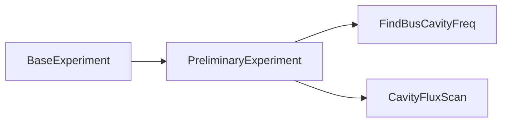
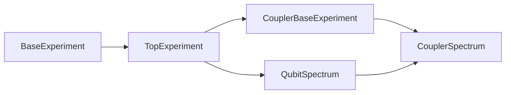
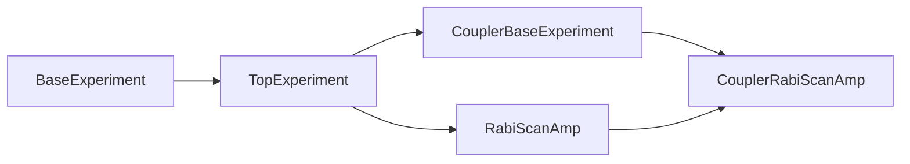
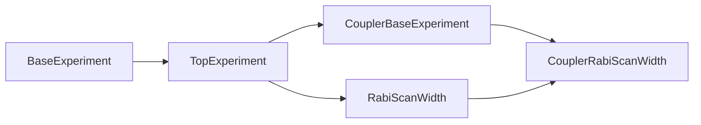
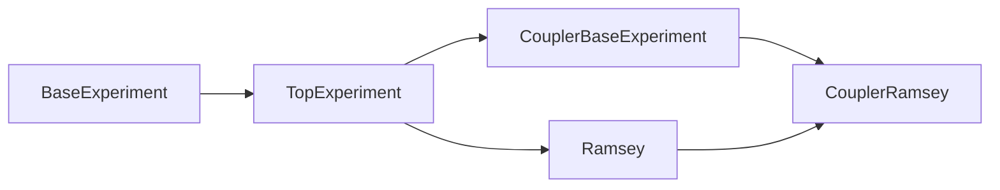

# pyqcat-visage 实验运行方法及选项功能说明

>该文档旨在完成以下目标：
>
>- 描述清楚 pyqcat-visage 中各实验的具体功能；
>- 描述清楚 pyqcat-visage 中各实验所需要的运行环境参数；
>- 描述清楚 pyqcat-visage 中各实验的实验选项及分析选项功能；
>- 描述清楚 pyqcat-visage 中各实验的期望运行结果；
>
>pyqcat-visage 正在积极开发攻坚问题中，文档会持续优化，请耐心等待..................

## Visage/Monster 实验环境概述

在 Visage 使用过程中，你经常会接触到实验环境的概念，它是测控实验成功运行的前提。实验环境必须包含下面参数的一个或者多个。

#### MonsterConfig

在使用 Monster 时，MonsterConfig 是最基础的实验配置，每个测控实验都需要有它的存在，它可以帮助测控实验：

-  获取一体机的 IP 地址并连接；
- 获取当前芯片名称，在实验存储路径中会加入芯片名称，可以对不同芯片的测试结果进行隔离；
- 获取日志存储路径，让 Monster 知道执行实验过程中产生的日志往哪里记载；
- 获取实验结果的存储方式，如本地文件存储或者S3对象存储；
- 日后扩延实验全局配置预留的结果；


如上图所示，此参数解释在很多地方我们都提到过，详情见 [pyqcat-visage 用户手册 (qpanda.cn)](https://document.qpanda.cn/docs/2wAlXOo7bXFnvwAP)

#### Instrument

Instrument 也是特别重要的对象，他是与一体机交互的基石，它可以协助你完成：

- 量子比特驱动线（一体机的 RF 模块）的脉冲，驱动频率，驱动功率的设置及任务下发；
- 量子比特控制线（一体机的 AWG 模块）的脉冲的设置及任务下发；
- 量子比特读取线（一体机的 ADDA 模块）的脉冲，驱动频率，驱动功率，触发延时，采样延时等设置及任务下发；
- 量子比特工作电电压的下发（一体机的 DC 模块）；
- 测控实验系统参数，如脉冲触发周期 pulse_period，默认为 100 ns；

Instrument 可以管理测控实验任务的组合及下发，在 Monster 中，所有涉及使用一体机进行模块参数设置及获取读取数据的实验，都必须用到 Instrument 对象。

值得注意的是，在 PreliminaryExperiment 实验中，因为我们一般使用矢量网络分析仪进行读取，且此时一般不涉及驱动波形的下发，DC电压使用单独封装的 QAIO（代码中适配，用户无需关注） 对象来进行管理。因此，在初测实验中，我们不需要添加 Instrument 对象到实验环境中。


如上图所示，Instrument 定义了测控实验的基础模板，具体如下：

- pulse_period：脉冲触发周期，测控实验或在同一任务参数下重复执行多次，通过对多次测量的结果进行处理获取实验数据；

- z_dc_control：DC 模块电压任务模块；

- z_flux_control：AWG 模块任务模板

  

- xy_control：RF 模块任务模板

  

- read_out_control：ADDA 模块任务模板


#### Qubit

Monster 的核心数据结构之一，整个测控软件也是围绕这个对象展开的，它是量子比特在软件层面的数据管理类，它可以：

- 记录量子比特的各项参数，如驱动频率、驱动功率、读取频率、读取功率等；
- 在测控实验中可以配置某些默认的实验状态，如 QubitSpectrum 实验需要扫描量子比特的驱动频率，那么它的读取频率和功率就可以通过实验环境中的 Qubit 对象自动幅值，它方便我们不用每个测控实验都需要手动去设置实验参数；
- 基于 Qubit 可以扩展一系列功能，如 HeatMap，芯片拓步结构等等；

基本上所有的测控实验中都需要有一个或者多个 Qubit 存在，唯一可能不需要的也许就是腔粗测实验了，如期望检查一根读取BUS上有多少腔，你可以使用 FindBusCavity，这个实验只需要知道接好线就可以了，不需要关注具体的量子比特。


#### Coupler

Coupler 严格意义上说就是一种特殊的 Qubit，因此它和 Qubit 的功能基本一致，这里不做过多赘述。


#### PulseCorrection

PulseCorrection 是一个非常重要的对象，它是实验脉冲修正类，每个量子比特对应一个唯一的 PulseCorrection，它可以：

- 让实验知道 XY 线之前应该添加多少的 delay；
- 让实验知道 Z 线之前应该添加多少的 delay；
- 让实验知道 Z 线应该补偿多大的 AC 值，可以用来做 AC 工作点；
- 修正 Z 线因畸变效应产生的影响；


如上图所示，PulseCorrection 中记录的参数及含义为：

- x_delay：当该比特 XY 线应该施加的前置延时时间，默认为 0；
- z_delay：当前比特 Z 线应该施加的前置延时时间，默认为 0；
- z_compensate：当前比特 Z 线全部 AC 补偿电压，默认为 0；
- z_distortion_width：畸变修正长度，一般根据执行畸变实验设置的长度为基准，默认为 0，不修正；
- z_distortion_ab：极点畸变阶跃响应模型拟合参数，当使用拟合模型进行畸变修正时，直接使用此参数；
- z_distortion_type：畸变修正类型，支持两种修正方式（① 阶跃原始测量响应数据通过时域-频域-时域的转化修正完成；② 通过拟合畸变数据获取阶跃响应模型参数，以此模型进行畸变修正）；
- z_distortion_tlist：畸变阶跃响应数据时间列表；
- z_distortion_solist：畸变阶跃响应数据响应参数列表；

在量子比特精细表征中它是一个非常重要的参数，它可以管来管理量子比特之间的 XYZTiming，ZZTiming，畸变，AC等，在初测中我们一般都是默认 0 的状态，所以在实验环境中，这个对象基本上伴随你从比特基础表征到 CZ 门的精细调节。

#### IQdiscriminator

IQdiscrimintor 也是一个非常重要的对象，它是量子比特读取判据管理器，一个比特可能会对应多个判据，因为我们可以有 0-1 之间的判据，0-2 之间的判据，0-1-2 之间的三分类判据。它可以

- 读取芯片从 IQ 数据至 P0/P1 数据的转化；
- 实验读取 P0/P1 结果的保真度修正

如果你想获取 P0/P1 类的概率数据，必须要在实验环境中配置  IQdiscriminator 参数。


- K：判据簇数，一般情况下的 2 分类；
- fidelity：0 态和 1 态的保真度 F0 / F1；
- probability：使用判据预测的概率，采集数据时使用；
- radius：分类圆斑的半径；
- outlier：异常点占比
- centers：圆斑中心位置；

#### working_dc

working_dc 用于确定量子芯片的工作点，它是一个键为 z_dc_channel，值为改通道下下发的具体值的字典，如果你期望在测试过程中为其他比特实验施加电压，以确保待测比特的期望性质，那么你必要有这样的参数。


如上图， 72 比特芯片的所有 Qubit 和 Coupler 均施加了 DC

#### corsstalk

crosstalk 从字面意思也可以知道，它是用来管理量子比特之间的串扰信息，它支持 AC 串扰可以 DC 串扰，如果你想在测控实验尽可能降低串扰的影响，你需要在实验环境中配置此参数，当然，此参数需要你使用测试实验提前表征好它。


#### env_bits

env_bits 表示环境比特的概念，如一块 72 比特的芯片，我们只想测试其中的 q0-q5 这 6 个比特，那么我们就可以直接设置 q0-q5 作为环境比特。环境比特的功能有：

- 添加系统工作电压 （working_dc），如环境为 q0-q5，那么 Monster 会自动获取 q0-q5 的 z_dc_channel，并获取他们应该施加的电压值 DC，组合成 working_dc 进行任务下发。因此可以看出 working_dc 其实不需要我们挨个通道去设置，只需要根据环境比特来生成即可；
- 在 AC 直通方案中，可以根据环境比特生成系统工作 AC 电压；
- 预留作为后续芯片局部测试的扩展功能；

如下图，将 72 比特中的所有比特作为环境比特：


## 标准实验基类 (BaseExperiment)

### 功能说明

在 pyqcat-monster 中所有的测控实验均继承自 BaseExperiment，如下图，它定义了测控实验的标准流程及一些默认的参数选项。它是测控实验的基础，它携带的功能选项使用与所有实验。


### 实验选项

我们开放的实验选项有：

| 选项名                                      | 功能                                 | 默认值 |
| ------------------------------------------- | ------------------------------------ | ------ |
| [show_result](#show_result)                 | 选择是否使用日志记录实验结果         | True   |
| [save_result](#save_result)                 | 是否保存实验结果至数据库，默认不更新 | False  |
| [simulator_data_path](#simulator_data_path) | 模拟数据本地地址                     | None   |
| *[simulator_shape](#simulator_shape)*       | 模拟数据分割维度（一般不建议修改）   | None   |

#### show_result

`True` 或 `False`，我们给定了默认值 `True`，即默认每个实验执行后，日志输出实验结果，如下图：


#### simulator_data_path

本地模拟数据地址，默认为 `None`。当你指定模拟数据地址时，monster 会自动读取模拟数据会进行分析处理，实现本地自定义数据验证测试，案例如下：

```python
    t2_exp = T2Ramsey.from_experiment_context(context)
    
    t2_exp.set_experiment_options(
        delays=qarange(0, 36000, 360),
        fringe=566.667 - (1 / 4400),
        simulator_data_path='../data/T2/'  # 指定模拟数据地址
    )

    t2_exp.run()
```


注意这里直接指定模拟数据文件存放的目录即可，不需精确到具体的文件名。这样做的目的是为了使复合实验模拟数据的选择变的简单，以两次 Ramsey 实验校准比特频率的 QubitFreqCalibration 实验为例，我们可以这样配置模拟器

```python
    exp = QubitFreqCalibration.from_experiment_context(context)

    exp.set_experiment_options(
        fringes=[100, -100],
        delays=qarange(10, 70, 0.625),
        simulator_data_path='../data/QubitFreqCalibration/',
        show_result=True
    )

    exp.set_analysis_options(freq_gap_threshold=0.2)

    exp.child_experiment.set_analysis_options(
        quality_bounds=[0.98, 0.9, 0.8],
    )

    exp.run()
```


#### simulator_shape

模拟数据自定义结构选项，默认为 `None`。此选项只有当你面对多层复合实验时会使用到，如 DetuneCalibration

实验，需要先执行多次粗扫的 APEComposite 实验，然后再执行多次细扫的 APEComposite 实验，因为作为 DetuneCalibration 子实验的 APEComposite 本身也是一个复合实验，因此在使用模拟器时，我们需要为每个 APEComposite 实验分配模拟数据。这里就需要设置 `simulator_shape` 选项为 `(3, 2)`, 它表示前三组模拟数据为首个子实验所有，后 2 组模拟数据为第二个子实验所有。案例如下：

```python
    ape = DetuneCalibration.from_experiment_context(context)

    ape.set_experiment_options(
        detune_list=qarange(-25e-3, 5e-3, 1e-3),
        rough_n_list=[6, 7, 8],
        fine_n_list=[7, 9],
        theta_type="Xpi",
        fine_precision=0.5e-3,
        simulator_shape = [3, 2],
        simulator_data_path='../data/DetuneCalibration/'
    )

    ape.set_analysis_options(diff_threshold=0.2)

    ape.run()
```


 .png)

### 分析选项

| 选项名  | 功能                                                         | 默认值     |
| ------- | ------------------------------------------------------------ | ---------- |
| is_plot | 用于决定是否绘制实验结果图，对于稳定的测控实验，如果想竟可能的提升运行速度，可以将结果图绘制功能关闭，这样实验仍然可以输出分析结果，但是并不绘图； | True       |
| figsize | 结果图画布大小。老版本中的 pyqcat 在一个实验中可以绘制多张实验结果图，而在 pyqcat-monster 中可以确保每个测控实验有且仅有一张实验结果图，区分是它将不同的子图整合到了一张大图中，便于测试人员查阅所有的结果。一般可用这个参数控制你的画布大小，让实验结果更加美观。 | （12， 8） |

## 初测实验 (PreliminaryExperiment)

### PreliminaryExperiment

#### 功能说明

PreliminaryExperiment 为腔粗测实验基类，它的典型特征是不依赖一体机进行读取，往往依赖商用仪器如 E5071C 进行读取，因为我们专门为这一类实验归纳成了 PreliminaryExperiment  基类，它不可以独立运行，必须定义具体的子类才可执行。

#### 继承结构



所有粗测实验都沿用 BaseExperiment 继承过来的实验选项和分析选项。

#### 实验选项

无自身专属选项，沿用 BaseExperiment 实验选项。

#### 分析选项

无自身专属选项，沿用 BaseExperiment 分析选项。

### FindBusCavityFreq

#### 功能说明

FindBusCavityFreq 实验用于粗扫某根 BUS 上的腔，可以初步确定一根 BUS 所有腔的大致位置。

#### **继承结构**


FindBusCavityFreq 实验复用 BaseExperiment 的实验/分析选项。

#### 实验选项

| 选项名           | 功能                                                         | 默认值                 |
| ---------------- | ------------------------------------------------------------ | ---------------------- |
| freq_list        | 网分扫描的频率列表（MHz）                                    | qarange(6000, 7000, 1) |
| network_analyzer | 网分型号                                                     | E5071C                 |
| net_power        | 网分输出功率（db）                                           | -30                    |
| bus              | BUS编号，该参数可以在结果保存路径中显示BUS编号，用于区别不同BUS线上的测试结果 | 0                      |
| ATT              | 网分功率衰减（db），用于**记录**实际网分的衰减功率，在实验结果中展示 | 0                      |
| net_IFBW         | 网分中频带宽（MHz）                                          | 500                    |

#### **分析选项**

| 选项名       | 功能                                            | 默认值 |
| ------------ | ----------------------------------------------- | ------ |
| distance     | 寻谷的最小间隔限制                              | 20     |
| cavity_count | 腔个数，分析流程会根据此值寻找到相应个数的谷值6 | 6      |

#### 实验环境参数

- **config：**环境配置，必须包含，**只要在环境中存在 config 均可以执行此实验，其他任何多余的参数添加不会影响此实验执行**；

#### 期望运行结果


### CavityFluxScan

#### 功能说明

CavityFluxScan 实验可用于：

- 粗扫某个 DC 线电压对大范围腔频的调制，用于初步确定各个比特的腔频率位置及调制情况；
- 细扫某个比特的 DC 电压，进行比特腔调制谱测试，获取 dc_max，dc_min 以及 fr_max 的值；
- 细扫某各耦合器的 DC 电压，进行耦合器腔调制谱，获取 dc_max，dc_min；

#### 继承结构


CavityFluxScan 实验复用 BaseExperiment 的实验/分析选项。

#### 实验选项

| 选项名                   | 功能                                                         | 默认值                 |
| ------------------------ | ------------------------------------------------------------ | ---------------------- |
| freq_list                | 网分扫描的频率列表（MHz）                                    | qarange(6000, 7000, 1) |
| network_analyzer         | 网分型号                                                     | E5071C                 |
| net_power                | 网分输出功率（db）                                           | -40                    |
| [bus](#bus)              | BUS编号，该参数可以在结果保存路径中显示BUS编号，用于区别不同BUS线上的测试结果 | 0                      |
| ATT                      | 网分功率衰减（db），用于**记录**实际网分的衰减功率，在实验结果中展示 | 0                      |
| net_IFBW                 | 网分中频带宽（MHz）                                          | 500                    |
| dc_source                | 电压源型号，默认为一体机的仪器模式 `qaio`                    | qaio                   |
| dc_channel               | 扫描 DC 的输出通道，如果实验环境中有 Qubit 或 Coupler，将自动更新至 Qubit 或 Coupler 的 z_dc_channel； | 1                      |
| dc_list                  | 扫描输出的电压列表                                           | None                   |
| *dynamic_plot*           | 是否开启动态绘制色谱图                                       | False                  |
| [fine_scan](#fine_scan)  | 是否进行细扫                                                 | True                   |
| [scan_name](#scan__name) | 一体机的扫描方式                                             | dc                     |
| [save_mode](#save_mode)  | 结果存储模式                                                 | 0                      |

##### fine_scan

fine_scan 选项用来进行粗扫模式和细扫模式的切换，默认为 `True`，即细扫模式。

- 当 `fine_scan` 设置为 `True` 时，我们认为是在某个已知的腔频下进行细扫，以此获取调制情况。我们对每个 DC 下的扫腔结果使用 CavityAnalysis 来进行数据处理，它使用 `skewed_lorentzian (倾斜洛伦兹)` 进行结果拟合，预期结果如下：

  

  

  

- 当 `fine_scan` 设置为 `False` 时，我们认为是在未知腔频下进行粗扫，以此获取DC通道输出对不同腔的调制情况。我们对每个 DC 下的扫腔结果使用 BusCavityAnalysis 来进行数据处理，它对结果使用寻峰处理，预期结果如下：

  


##### bus

根据实际网分接线方式修改，默认值为 `None`，此处如果设置将会在实验结果记录中增加 BUS 编号的记录，案例如下：


##### scan_name

monster 中的腔调制谱支持了 AC 直通调制方案，你只需要将选项 scan_name 切换至 ac 即可，两种方案下的参数解释为：

- scan_name = dc：DC 调制测试

  - dc_channel：扫描的 DC 通道
  - dc_list：扫描的 DC 电压值
  - 其他比特 DC 的设置方法：通过环境配置或者直接设置，如下：

  ```python
  context = ExperimentContext()
  
  # choice1：configure environment to band working dc
  exp_context.configure_environment(['q0', 'q1', 'q2', 'q3', 'c0', 'c1', 'c2'])
  exp = CavityScanFlux.from_experiment_context(context)
  
  # choice2：directly set
  exp.working_dc = {
      '1': 0.2,
      '2': 0.3
  }
  ```

- scan_name = ac：AC 调制测试

  - dc_channel：扫描的 AC 通道
  - dc_list：扫描的 AC 幅值
  - 其他比特 AC 的设置方法：通过给实验 working_dc 绑定字典，如下：

  ```python
  context = ExperimentContext()
  exp = CavityScanFlux.from_experiment_context(context)
  exp.working_dc = {
      '1': 0.2,
      '2': 0.3
  }
  ```

##### save_mode

save_mode 用于管理实验结果的保存至数据库的方式，支持选择：

- 0：保存 dc_max，dc_min，fc_max；
- 1：保存 dc_max，fc_max；

> 注意：
>
> - 此选项生效的前提必须保证 BaseExperiment 中的选项 save_result 为 True；
> - 目前仅当 scan_name 为 dc 时，才会更新，ac 直通方案的调制需用手动修改，待方案成熟后再加逻辑；

#### 分析选项

| 选项名         | 功能                                                         | 默认值           |
| -------------- | ------------------------------------------------------------ | ---------------- |
| diff_threshold | Qubit 腔调制谱中最大腔谱和最小腔谱差值的最小阈值，当差值大于此值时，判断为样品可调，小于此值时，判断为样品不可调 | 0.1 MHz          |
| fit_q          | 是否对单次扫腔实验结果进行 Q 值拟合（仅细扫单个腔时有用）    | False            |
| tackle_type    | 分析类型，支持 rough（仅展示二维深度色谱图），Qubit（进行最小值和最大值的搜索），Coupler（进行劈裂点，最小值，最大值的搜索） | rough            |
| quality_bounds | 调制谱拟合质量评估阈值，经 Qubit 调制谱分析时有效；          | [0.98,0.95,0.90] |

#### 实验环境参数

- **config：**实验环境配置，必须存在；
- env_bits：当需要添加其他比特的 DC 电压或 AC 电压时，需要配置；
- qubit：进行 Qubit 调制谱测试时配置；
- coupler：进行 Coupler 调制谱测试时配置；
- working_dc：系统工作的 DC 电压字典；

① 当进行某个 DC 通道粗测时，你可以直接修改 dc_channel 选项为你期望的通道，然后将 fine_scan 设为 False，表示粗扫，环境中保证只有 config 即可，测试如下：


② 当你不想手动给 DC 通道，测试某个单独比特的调制情况，你可以直接在 Context 中右键手动添加你期望的测试比特，设置如下：


③ 当你想单独测试某个 coupler 的调制情况，你可以直接在 Context 中右键0手动添加 Coupler，测试如下：


④ 当你想独立测试比特的调制谱，需要为其他比特添加工作电压时，你可以使用标准实验环境中的 tunable_first / tunable_second 来进行测试，他们区别为：

- tunable_first：除测试比特外，所有比特的 DC 置为 0，所有耦合器的 DC 置为 dc_max 点，如下，环境比特设置为q0，q1，c0，表示需要添加这三个比特的工作点，测试比特为 q0，所有 q1 对应的 DC 2 通道置为 0 v，c0 对应的 DC 3 通道置为 0.2 v；


- tunable_second：除测试比特外，所有比特的 DC 置为 dc_min 点，所有耦合器的 DC 置为 dc_max 点，如下，环境比特设置为q0，q1，c0，表示需要添加这三个比特的工作点，测试比特为 q0，所有 q1 对应的 DC 2 通道置为 dc_min = -0.1 v，c0 对应的 DC 3 通道置为 dc_max = 0.2 v；


#### 期望运行结果

- 腔大范围粗扫


- Coupler 细扫


- Qubit 细扫


## 基础实验 (TopExperiment)

### TopExperiment

#### 功能说明

TopExperiment 为基础实验模板。我们将基础实验定义为不需要循环扫描某种参数或者仅扫描一种参数，且采集的实验数据为标准 `amp-phase` 或 `p0-p1` 模式；测控实验只能继承它来实现自己的执行逻辑，不能单独运行此实验。

#### 继承结构

它可以继承使用 BaseExperiment 的实验选项。


#### 实验选项

在 monster 中，我们定义基础实验是与一体机交互的最小实验单元，不需要循环扫描某种参数或者仅扫描一种参数，且直接与数据库交互的实验，因此我们开放了下面的实验选项：

| 选项名                                              | 功能                                                         | 默认值      |
| --------------------------------------------------- | ------------------------------------------------------------ | ----------- |
| *[bind_dc](#bind_dc)*                               | *绑定 DC 选项（不建议修改）*                                 | *True*      |
| *[bind_drive](#bind_drive)*                         | *绑定驱动参数（不建议修改）*                                 | *True*      |
| *[bind_probe](#bind_probe)*                         | *绑定读取参数（不建议修改）*                                 | *True*      |
| **[file_flag](#file_flag)**                         | **一体机保存原始采集数据方式选项**                           | **0**       |
| *[multi_readout_channels](#multi_readout_channels)* | *多比特读取通道选项（不建议修改）*                           | *None*      |
| **[repeat](#repeat)**                               | **小循环次数**                                               | **1000**    |
| *[data_type](#data_type)*                           | *数据回传类型（不建议修改）*                                 | *amp_phase* |
| *enable_one_sweep*                                  | *是否仅执行单次实验，不扫描参数的测控实验，如云平台的基础线路算法，经执行一次即停（不建议修改）* | *False*     |
| **[register_pulse_save](#register_pulse_save)**     | **是否保存注册的波形数据**                                   | **False**   |
| **[schedule_flag](#schedule_flag)**                 | **是否绘制脉冲时序图**                                       | **True**    |
| **[schedule_index](#schedule_index)**               | **时序图绘制索引**                                           | **-1**      |
| **[schedule_save](#schedule_save)**                 | **是否将时序图存储至指定位置**                               | **True**    |
| **[schedule_measure](#schedule_measure)**           | **是否绘制读取脉冲时序图**                                   | **True**    |
| **[schedule_type](#schedule_type)**                 | **时序绘制方式选项**                                         | **envelop** |
| **[schedule_show_measure](#schedule_show_measure)** | **时序图中显示读取波形的长度**                               | **150**     |
| **[schedule_show_real](#schedule_show_real)**       | **时序图中是否显示真实数据**                                 | **True**    |
| **[is_dynamic](#is_dynamic)**                       | **是否进行动态绘图**                                         | **1**       |
| *[measure_bits](#measure_bits)*                     | *读取比特选项（不建议修改）*                                 | *None*      |
| *[loop_num](#loop_num)*                             | *循环次数选项（仅 SingleShot 使用，不建议修改）*             | *1*         |
| **[save_label](#save_label)**                       | **实验结果存储扩展标签**                                     | **None**    |
| *[iq_flag](#iq_flag)*                               | *是否获取 IQ 数据（仅 SingleShot 使用，不建议修改）*         | *False*     |
| **[ac_prepare_time](#ac_prepare_time)**             | **实现波形前置 AC 补偿时间**                                 | **5000**    |
| *[idle_qubits](#idle_qubits)*                       | *todo（不建议修改）*                                         | *[]*        |
| **[use_dcm](#use_dcm)**                             | **是否使用判据**                                             | **True**    |

##### **bind_dc**

绑定DC选项。`True` or `False`，用于为一体机初始化 DC 电压源输出，默认为 `True`。

- True: 如果比特 `dc` 属性不为空，且实验 `working_dc` 属性不为空，则根据比特的DC通道为一体机设置初始电压；
- False: 不设置DC电压

```python
def _bind_qubit_dc(self, qubit: Qubit):
    """Bind qubit voltage to instrument."""
    if self.experiment_options.bind_dc:
        if qubit.dc is not None and self.working_dc:
            self.inst.set_dc(channel=qubit.z_dc_channel, value=qubit.dc)
```

##### **bind_drive**

`True` or `False`，用于为一体机绑定各比特的驱动频率和功率，默认为 `True`。

- True：遍历当前实验中的量子比特，加载比特的 `drive_freq` 和 `drive_power` 属性并为一体机设置；
- False：不初始化 XY 线 RF 模块的默认输出参数；

```python
def _bind_qubit_drive(self, qubit: Qubit):
    """Bind qubit drive parameters to instruments."""
    if self.experiment_options.bind_drive:
        if qubit.drive_freq is not None:
            self.inst.set_output_freq(
                module='XY_control',
                channel=qubit.xy_channel,
                value=qubit.drive_freq
            )

        if qubit.drive_power is not None:
            self.inst.set_power(
                module='XY_control',
                channel=qubit.xy_channel,
                value=qubit.drive_power
            )
```

##### **bind_probe**

`True` or `False`，用于为一体机绑定比特的读取频率、读取功率、采样延时和采样宽度，默认为 `True`。

- True：获取当前实验绑定的比特，为一体机设置比特的读取频率、读取功率、采样延时和采样宽度参数；
- False：不设置读取参数；

```python
def _bind_probe_inst(self, qubit: Qubit):
    """Bind qubit information to instrument."""
    if qubit.probe_freq is not None:
        self.inst.set_output_freq(module='Readout_control',
                                  channel=qubit.readout_channel,
                                  value=qubit.probe_freq)

    if qubit.probe_power is not None:
        self.inst.set_power(module='Readout_control',
                            channel=qubit.readout_channel,
                            value=qubit.probe_power)

    if qubit.sample_delay is not None:
        self.inst.set_sample_delay(qubit.readout_channel,
                                   qubit.sample_delay)

    if qubit.sample_width is not None:
        self.inst.set_sample_width(qubit.readout_channel,
                                   qubit.sample_width)
```

> **注意：**此选项仅在单比特实验中有效；

##### **file_flag**

一体机是否保存原始采集数据及存储方式选项

- 0：不保存原始文件
- 1：保存原始二进制文件
- 2：保存解码后的文件

##### **multi_readout_channels**

多读取通道

##### **repeat**

单词实验的重复次数，它表示完全相同的实验条件下的重复实验次数，默认值为 1000 次

##### **data_type**

回传数据类型选项。当前我们仅提供两种方式

- I_Q：回传 I、Q 数据
- amp_phase：回传 amp、phase 数据

##### **register_pulse_save**

是否将实验下发的波形保存至本地，如 CavityFreqSpectrum 实验，将你将此选项开启后，可以在它的时序图文件夹中看到脉冲 `.dat` 数据，如下：


##### schedule_flag

时序图启动开关选项。`True` or `False`，默认为 `True`，开启绘制时序图功能。我们默认时序图存储在实验目录下的 schedule 文件目录中，如下图：


##### **schedule_index**

绘制时序图索引选项， 默认值为 -1（最后一个扫描参数实验的时序图）。一般基础实验中，我们都会使用针对某个参数进行扫描重复实验，因此我们支持自定义时序图的索引，你可以设置：

- 整形数值（int）：期望绘制的时序图索引，必须在 0 和扫描参数总长之间；
- 整形列表（list）：当你期望绘制多个扫描参数下的时序图，你可以设置列表进行，如 [0, 5, 10]，同样列表中的每个值都必须在 0 和扫描参数总长之间；
- 字符串（str）：当你期望绘制所有扫描参数下的时序图，你可以直接设置成 **`all`**；


##### **schedule_save**

时序图保存选项，默认为 `True`。你可以设置：

- True：保存时序图至配置的地址中
- Flase：绘制时序图但不保存

##### **schedule_measure**

读取脉冲时序图绘制选项，默认为 `True`。你可以设置：

- True：绘制读取波形
- False：不绘制读取波形


##### **schedule_type**

脉冲时序展示方式选项，默认为 `envelop`。你可以设置：

- envelop：绘制脉冲包络
- squence：绘制脉冲实际数值序列


##### **schedule_show_measure**

读取波形绘制长度选项，默认为 150 ns。在时序图中，我们经常会遇到这种情况，驱动的波形特别短，读取波形特别长，如 RabiScanAmp 实验，假设单门长度 30ns，读取脉冲 4000ns，那么驱动线的时序只有 30 ns，读取波形确有 4k 多，如果将这两个会在一起，则驱动线的时序图我们无法识别，如下图：


此时我们更改期望绘制的读取波形长度来改变时序图状态，如下图


##### **schedule_show_real**

todo

##### **is_dynamic**

动态绘图选项，默认为1，表示绘制单比特实验动态绘图，开放给 visage 使用，你可以设置

- 1：开启动态绘图
- 0：关闭动态绘图

##### **measure_bits**

读取比特的编号选项，默认为 `None`。此选项当前没有开放功能，我们期望后续可实现多比特联合读取中仅获取我们期望的比特的读取结果。

##### **loop_num**

实验结果循环次数分割选项，默认为 1。此选项目前仅在 SingleShot 实验中需要设置。

SingleShot 实验中，如果我们期望将 repeat 设置为 20000。受到一代机的限制，最大小循环次数为 10000。所以只能将重复 20000 次的实验拆成2个执行10000次的实验，同理在获取采集数据时，需要将 2 个执行10000次的子实验结果汇总，这是就用到了 loop_num 选型，它告知采集数据模块需要经接受到的数据按照规则进行组合返回。

##### **save_label**

实验结果存储标签选项，默认为 `None`。基础实验中我们默认以实验名称和 data_type 来进行文件命名，如果你想扩展结果文件名，你可以通过此选项扩展，如下图：


##### **iq_flag**

IQ数据记录选项，默认为`False`。当前 monster 中仅有 SingleShot 实验需要设置 iq_flag 为 True，你可以选择：

- True：存储的采集数据为 IQ 数据；
- False：存储的采集数据为 P0/P1 数据或 amp/phase 数据；

##### **ac_prepare_time**

AC线前置补偿时间选项，默认为 5000 ns。当比特的 Z 线需要施加全部 AC 时，为了消除畸变影响，需要在时序前面加上前置 AC 补偿，因此我们添加这个选项，其中

- XY线通过设置触发延时的方式补偿；
- Z线通过设置方波的形式实现补偿；

##### **idle_qubits**

todo

##### **use_dcm**

在常规测控实验中，我们获取分析数据的方式有两种：

- amp / phase 类型；
- P0 / P1 类型，通过 IQ 分类器将 IQ 数据分类成 P1 和 P0 的概率返回，前提必须要有 IQ 分类器，所以在测控中必须保证；

在执行实验室，如果我们即想查看不使用判据的 amp/phase 数据，又想查看使用判据的 P0/P1 数据，比较复杂的方式为先不给实验传递判据测试获取 amp/phase，然后为实验添加判据，测量获取 P0/P1 数据，这样的方式需用用户介入修改实验环境；

为了方便上述功能的实验，我们在基础实验选项中新增了 use_dcm 选项，你可以始终保持你的实验环境中存在 IQ 分类器，但是你可以通过 use_dcm 的选项来选择是否使用这个判据，如果 use_dcm 为 False，则获取 amp/phase 数据，如果 use_dcm 为 True，则获取 P0/P1 数据。

#### 分析选项

基础实验无默认分析选项，继承 BaseExperiment 实验。

### CouplerBaseExperiment

#### 实验说明

CouplerBaseExperiment 为 Coupler 表征实验的基类实验，它不具备独立执行的能力，必须定义子实验实现特定功能才可执行。

#### 继承结构


#### 实验选项

可调耦合结构通过耦合器的Z线来调节耦合器关联的两个比特的耦合强度，因此需要对耦合器进行一系列的表征实验，获取耦合器Z线对其频率的调制关系，以及耦合器频率对关联比特的调制能力。我们开放了下面的选项。

| 选项名      | 功能                              | 默认值 |
| ----------- | --------------------------------- | ------ |
| head_time   | 前置补偿                          | 0      |
| tail_time   | 读取比特 X 波形后置补偿           | 0      |
| right_delay | 实验波形与读取比特X波形之间的补偿 | 0      |
| add_z_delay | Z线读取波形补偿                   | 0      |


#### 分析选项

CouplerBaseExperiment 没有特有的实验选项，沿用 BaseExperiment 及 TopExperiment 实验。

### CavityFreqSpectrum

#### 功能说明

CavityFreqSpectrum 实验用于测量比特的读取频率，它扫描读取线的驱动频率，使用洛伦兹拟合寻找腔谷位置对应的频率，记为比特的读取频率（probe_freq），又称为腔频； 

#### 继承结构


#### 实验选项

| 选项名           | 功能                                                         | 默认值 |
| ---------------- | ------------------------------------------------------------ | ------ |
| fc_list          | 实验扫描读取频率（比特腔频）列表                             | None   |
| readout_power    | 读取功率                                                     | None   |
| add_pi_pulse     | 是否添加 `pi_pulse`，默认为 `False(不添加)`                  | False  |
| pi_amp           | 添加 `pi_pulse` 的幅值，此选型仅到 `add_pi_pulse` 为 True 时生效 | None   |
| [scope](#scope)  | 当前比特腔频上下描范围（MHz）                                | 3      |
| [points](#scope) | 在当前比特腔频上下扫描范围内扫描的点数                       | 61     |
| z_amp            | Z 线上施加的幅值                                             | None   |

##### **scope**

实验中的 `fc_list` 和 `readout_power` 如果不指定，我们会执行下面的操作：

- 获取实验绑定量子比特的腔频 `fc`；
- 在 `fc-scope` 至 `fc+scope` 的范围内扫描 `points` 个点做为实验下发的 `fc_list`；
- 获取实验绑定量子比特的读取功率作为 `readout_power` 选项下发

#### 分析选项

| 选项名                            | 功能             | 默认值             |
| --------------------------------- | ---------------- | ------------------ |
| [quality_bounds](#quality_bounds) | 拟合优度频率阈值 | [0.98, 0.95, 0.85] |

##### **quality_bounds**

拟合优度评估阈值，根据拟合优化将实验质量划分为 4 个等级，拟合优度直接影响到实验结果的保存，分别为：

- 1 - 0.98：perfect；
- 0.95 - 0.98：normal；
- 0.85 - 0.95：abnormal；
- 0 - 0.85：bad；

#### 实验环境参数

CavityFreqSpectrum 依赖的实验环境参数有：

- config：实验运行配置；
- inst：该实验借助一体机进行任务下发及读取，因此必须有 Instrument 对象；
- env_bits：实验需要系统工作的环境比特，以此去配置系统工作 DC/AC；
- Qubit：实验需要知道具体的测试比特；
- PulseCorrection：与特定比特绑定的脉冲修正类，在 DC 直通方案中只需绑定测试比特的即可，在 AC 直通方案中，因为环境比特均需要施加 Z 线脉冲维持 AC 工作点，所以所有的环境比特均需要添加 PulseCorrection；
- working_dc：系统工作 DC，借助 env_bits 生成；

正常测试时，直接使用标准环境生成器中的 qubit_calibration 即可；use_dcm 用来选择是够添加 IQ 判据；ac_switch 用来选择是否使用 AC 直通方案；crosstalk_dict 用来选择是否添加串扰矩阵修正；


#### 实验预期结果

此实验会更新 Qubit 的 probe_freq 和 probe_power 属性，当你将 save_result 选项设置为 True 时，且分析结果的质量（quality 为 perfect 或 normal，你可以通过分析选项 quality_bounds 选项来调节对结果的严苛程度）状态时，它会自动将实验结果保存至数据库，并刷新你的实验环境； 


### CavitySpectrumF12

#### 实验说明

CavitySpectrumF12 功能与 CavityFreqSpectrum 功能类似，它新增的功能是可以在 XY 线加上 2 态驱动的情况下，测量腔谱，在 0, 1, 2 三态腔 Shift 实验中，我们会用到这个实验。

#### 继承结构


#### 实验选项

| 选项名  | 功能                                  | 默认值 |
| ------- | ------------------------------------- | ------ |
| add_f12 | 选择是否在 XY 线上添加 2 态 Drag 波形 | False  |

#### 分析选项

| 选项名                            | 功能             | 默认值             |
| --------------------------------- | ---------------- | ------------------ |
| [quality_bounds](#quality_bounds) | 拟合优度频率阈值 | [0.98, 0.95, 0.85] |

#### 实验环境参数

和 CavityFreqSpectrum 一致，使用 qubit_calibration 标准环境生成器即可；

#### 预期实验结果

与 CavityFreqSpectrum 一致


### QubitSpectrum

#### 功能说明

QubitSpectrum 实验用于测量比特的驱动频率，它扫描驱动线 XY 的驱动频率，使用洛伦兹拟合寻找峰（谷）位置对应的频率，记为比特的读取频率（dirve_freq），又称为比特频率； 

#### 继承结构


#### 实验选项

| 选项名                          | 功能                                                         | 默认值     |
| ------------------------------- | ------------------------------------------------------------ | ---------- |
| [freq_list](#freq_list)         | 实验扫描驱动频率列表                                         | None       |
| [drive_power](#drive_power)     | 驱动功率                                                     | None       |
| [z_amp](#z_amp)                 | Z 线施加的 AC 值，用于测量不同 AC 下的比特频率               | None       |
| [use_square](#use_square)       | 驱动波形添加类型，默认使用方波（True），否则使用变频方波（False） | True       |
| [band_width](#band_width)       | 变频方波下，波形的带宽值                                     | 50         |
| [fine_flag](#fine_flag)         | 粗扫和细扫的开关，默认为粗扫（False）                        | False      |
| [smooth_params](#smooth_params) | 实验结果分析中寻峰处理参数                                   | 详情见下方 |
| [xpulse_params](#xpulse_params) | XY线下发波形参数                                             | 详情见下方 |
| [zpulse_params](#zpulse_params) | Z线下发波形参数                                              | 详情见下方 |

在 QubitSpectrum 实验中，我们实现了：

##### **freq_list**

- 外部设置的驱动频率列表；

- 选型 freq_list 支持不填，当 freq_list 为空时，会从当前实验绑定的比特中加载驱动频率 fd，并在 qarange(fd - 50, fd + 50, 2) 的范围内执行细扫实验，选项 use_square 和 fine_flag 自动更新为 True；

##### **drive_power**

驱动功率，支持默认值从当前实验绑定的比特中加载驱动功率 qubit.drive_power

##### **z_amp**

Z 线上施加的方波幅值，Z 线默认施加高斯方波（GaussianSquare），波形长度可根据选项 zpulse_params 进行设置，默认值为None，及Z线幅值默认给0；

##### **use_square**

能谱实验中，我们支持两种实验方式的切换，分别为方波（SquareEnvelop）和变频方波（VarFreqEnvelop）两种；


##### **band_width**

仅当选项 use_square 设置为 True 时生效，用于设置 VarFreqEnvelop 波形的频率带宽

##### **fine_flag**

粗扫和细扫的切换开关，默认为Flase（粗扫），粗扫和细扫最大的区别就是分析流程不一样。在粗扫后，我们使用 QubitSpectrumPreAnalysis 进行寻峰处理，而细扫后，我们使用 QubitSpectrumAnalysis 进行洛伦兹拟合处理。


##### **smooth_params**

- rough_window_length：粗扫寻峰算法中卷积窗口长度，默认为 7；
- rough_freq_distance：粗扫寻峰算法中的最小峰距，默认为 70 MHz；
- fine_window_length：细扫寻峰算法中卷积窗口长度，默认为 8；
- fine_freq_distance：细扫寻峰算法中的最小峰距，默认为 80 MHz；

##### **xpulse_params**

xpulse_params 参数用于设置实验中 XY 线的驱动波形参数；

- time：驱动波形长度，默认为 5000 ns；
- offset：两端施加 buffer，默认为 15 ns；
- amp：幅值系数， 0-1 之间；
- detune：失谐量，能谱测试一般为粗测，失谐量默认为 0；
- freq：驱动频率，默认为 466.667 MHz，如果比特驱动频率不为空，会自动替换成比特的驱动频率；

##### **zpulse_params**

zpulse_params 参数用于设置实验中 Z(AWG) 线的波形参数，Z 线默认使用高斯方波 GuassianSquare；

- time：脉冲长度，默认为 5100 ns，比 XY Pulse 略长，且中心对齐；
- amp：脉冲幅值，默认为 0；
- sigma：高斯方波上升沿参数，详情可查阅高斯方波；
- fast_m：高斯方波上升沿参数，详情可查阅高斯方波；

#### 分析选项

| 选项名                            | 功能         | 默认值          |
| --------------------------------- | ------------ | --------------- |
| [quality_bounds](#quality_bounds) | 拟合优度阈值 | [0.8, 0.6, 0.5] |
| [snr_bounds](#snr_bounds)         | 信噪比阈值   | 1.5             |

##### quality_bounds

quality_bounds 用于在细扫比特能谱时使用，细扫中使用洛伦兹拟合获取峰对应的频率，通过拟合优度来评估实验结果的质量，与 CavityFreqSpectrum 一样，我们还是通过 3 个数值将质量分为 perfect、normal、abnormal 和 bad 四类，后续涉及拟合处理分析的实验均携带此选项，且保持一致的功能；

##### snr_bounds

snr_bounds 用于粗扫比特能谱寻峰时时候，我们首先进行信号的信噪比计算，如果信噪比小于指定的值，则任务噪声太太，实验结果为 bad，否则为 perfect；

#### 实验环境参数

- config：实验运行配置；
- inst：该实验借助一体机进行任务下发及读取，因此必须有 Instrument 对象；
- env_bits：实验需要系统工作的环境比特，以此去配置系统工作 DC/AC；
- Qubit：实验需要知道具体的测试比特；
- PulseCorrection：与特定比特绑定的脉冲修正类，在 DC 直通方案中只需绑定测试比特的即可，在 AC 直通方案中，因为环境比特均需要施加 Z 线脉冲维持 AC 工作点，所以所有的环境比特均需要添加 PulseCorrection；
- working_dc：系统工作 DC，借助 env_bits 生成；

同 CavityFreqSpectrum 实验一致，可使用 qubit_calibration 标准环境生成器；

#### 实验预期结果

- 粗扫：


- 细扫，当拟合质量较好时，会更新 Qubit 的 drive_freq 和 drive_power


### QubitSpectrumF12

#### 实验说明

QubitSpectrumF12 实验用于测量比特 2 能级对应的频率

#### 继承关系


#### 实验选项

| 选项名      | 功能                                         | 默认值                 |
| ----------- | -------------------------------------------- | ---------------------- |
| f12_list    | 扫描 12 能级之间的激发频率                   | qarange(5500, 5600, 2) |
| drive_power | 驱动功率，默认从实验绑定的比特中获取读取功率 | None                   |

#### 分析选项

| 选项名                            | 功能                   | 默认值             |
| --------------------------------- | ---------------------- | ------------------ |
| [quality_bounds](#quality_bounds) | 拟合优度阈值           | [0.98, 0.95, 0.91] |
| window_length                     | 寻峰算法中卷积窗口长度 | 11                 |
| freq_distance                     | 寻峰算法中的最小峰距   | 80 MHz             |

#### 实验环境参数

- config：实验运行配置；
- inst：该实验借助一体机进行任务下发及读取，因此必须有 Instrument 对象；
- env_bits：实验需要系统工作的环境比特，以此去配置系统工作 DC/AC；
- Qubit：实验需要知道具体的测试比特；
- PulseCorrection：与特定比特绑定的脉冲修正类，在 DC 直通方案中只需绑定测试比特的即可，在 AC 直通方案中，因为环境比特均需要施加 Z 线脉冲维持 AC 工作点，所以所有的环境比特均需要添加 PulseCorrection；
- working_dc：系统工作 DC，借助 env_bits 生成；

同 CavityFreqSpectrum 实验一致，可使用 qubit_calibration 标准环境生成器；

#### 实验预期结果


### CouplerSpectrum

#### 实验说明

CouplerSpectrum 实验用于测量 Coupler 频率

#### 继承结构



#### 实验选项

与 QubitSpectrum 保持一致

#### 分析选项

与 QubitSpectrum 保持一致

#### 实验环境参数

- config：实验运行配置；
- inst：该实验借助一体机进行任务下发及读取，因此必须有 Instrument 对象；
- env_bits：实验需要系统工作的环境比特，以此去配置系统工作 DC/AC；
- Qubit：实验需要包含当前 coupler 的读取比特和驱动比特；
- Coupler：实验待测试的耦合器；
- PulseCorrection：与特定比特绑定的脉冲修正类，在 DC 直通方案中只需绑定测试比特的即可，在 AC 直通方案中，因为环境比特均需要施加 Z 线脉冲维持 AC 工作点，所以所有的环境比特均需要添加 PulseCorrection；
- working_dc：系统工作 DC，借助 env_bits 生成；
- IQdiscriminator：IQ 判据，Coupler 表征实验一般建议使用判据进行测试；
- crosstalk_dict：串扰矩阵，可选可不选

可使用 coupler_calibration 标准环境生成器：


#### 实验预期结果


### RabiScanAmp

#### 功能说明

RabiScanAmp 通过扫描 DRAG 波形的幅值得到初步 X 和 X/2 门；

#### 继承结构


#### 实验选项

| 选项名      | 功能                                         | 默认值              |
| ----------- | -------------------------------------------- | ------------------- |
| amps        | 扫描幅值列表                                 | qarange(0, 1, 0.02) |
| drive_power | 驱动功率，默认从实验绑定的比特中获取读取功率 | None                |
| name        | 扫描类型，支持 `Xpi` 和 `Xpi/2`              | Xpi                 |

#### 分析选项

| 选项名                            | 功能         | 默认值             |
| --------------------------------- | ------------ | ------------------ |
| [quality_bounds](#quality_bounds) | 拟合优度阈值 | [0.98, 0.95, 0.91] |

#### 实验环境参数

同 QubitSpectrum 实验，使用 qubit_calibration 标准实验环境生成器

#### 实验预期结果

此实验会更新 Qubit 的 XYwave.Xpi 和 drive_power 属性，当你将 save_result 选项设置为 True 时，且分析结果的质量（quality 为 perfect 或 normal）状态时，它会自动将实验结果保存至数据库，并刷新你的实验环境； 


### RabiScanAmpF12

#### 实验说明

RabiScanAmpF12 实验用于校准 2 态 pi pulse 的幅值

#### 继承结构


#### 实验选项

同 RabiScanAmp

#### 分析选项

同 RabiScanAmp

#### 实验环境参数

同 RabiScanAmp 实验，使用 qubit_calibration 标准实验环境生成器

#### 实验预期结果


### CouplerRabiScanAmp

#### 实验说明

CouplerRabiScanAmp 用于校准 Coupler 驱动 pi pulse 的幅值和驱动功率

#### 继承结构



#### 实验选项

同 RabiScanAmp 实验

#### 分析选项

同 RabiScanAmp 实验

#### 实验环境参数

同 CouplerSpectrum 实验，使用 coupler_calibration 标准实验环境生成器

#### 预期实验结果


### RabiScanWidth

#### 功能说明

RabiScanWidth 通过扫描 DRAG 波形的长度来验证测量的信号是否是真正的量子比特，通过改变驱动信号的时长，比特应该在两个能级之间来回翻转。

#### 继承结构


#### 实验选项

| 选项名      | 功能                                         | 默认值             |
| ----------- | -------------------------------------------- | ------------------ |
| drive_freq  | 驱动频率，默认从实验绑定的比特中获取驱动频率 | None               |
| drive_power | 驱动功率，默认从实验绑定的比特中获取驱动功率 | None               |
| widths      | 扫描 `pi_pulse` 宽度                         | qarange(5, 200, 5) |

#### 分析选项

| 选项名                            | 功能         | 默认值             |
| --------------------------------- | ------------ | ------------------ |
| [quality_bounds](#quality_bounds) | 拟合优度阈值 | [0.98, 0.95, 0.91] |

#### 实验环境参数

同 RabiScanAmp实验，使用 qubit_calibration 标准实验环境生成器

#### 实验预期结果

RabiScanWidth 不更新具体的参数，仅用于验证当前的比特频率是否正确。


### RabiScanWidthF12

#### 实验说明

RabiScanWidthF12 用于检测比特的 2 态频率是否准确

#### 继承结构


#### 实验选项

| 选项名      | 功能                                                      | 默认值             |
| ----------- | --------------------------------------------------------- | ------------------ |
| f12_freq    | 2 态驱动频率，默认从实验绑定的比特中获取驱动频率          | None               |
| drive_power | 驱动功率，默认从实验绑定的比特 f12_options 中获取驱动功率 | None               |
| widths      | 扫描 2 态 `pi_pulse` 宽度                                 | qarange(5, 200, 5) |

#### 分析选项

| 选项名                            | 功能         | 默认值             |
| --------------------------------- | ------------ | ------------------ |
| [quality_bounds](#quality_bounds) | 拟合优度阈值 | [0.98, 0.95, 0.91] |

#### 实验环境参数

同 RabiScanWidth 实验，使用 qubit_calibration 标准实验环境生成器

#### 实验预期结果


### CouplerRabiScanWidth

#### 实验说明

CouplerRabiScanWidth 实验用于检测 Coupler 驱动频率是否准确

#### 继承结构



#### 实验选项

同 RabiScanWidth 实验

#### 分析选项

同 RabiScanWidth 实验

#### 实验环境参数

同 CouplerSpectrum 实验，使用 coupler_calibration 标准实验环境生成器

#### 实验预期结果


### SingleShot

#### 功能说明

SingleShot 实验分别施加 I 门 和 X 门获取不通过的 IQ 数据进行分类，以此获取 IQ 分类器

#### 继承结构


#### 实验选项

| 选项名                  | 功能                                                         | 默认值  |
| ----------------------- | ------------------------------------------------------------ | ------- |
| *save_bin*              | *是否根据分类质量存储 IQ 判据至数据库，仅到评估质量为 perfect, normal 状态时，才会更新 bin*，*它与 save_result 选项功能一致，二者有一个为 True，都会保存判据。此选项后续版本可能会被移除，不建议修改。* | *False* |
| [level_str](#level_str) | IQ 分类器存储的标签                                          | None    |

##### **level_str**

IQ 分类器的存储标签，我们可以利用 SingleShot 获得 01 态之间的判据，12 态之间的判据，012 态之间的三分类判据等，为了区别这个不同的判据，你可以使用 level_str 来进行分类器的标记，并下发不通过的实验任务参数，我们提供下面几种选择：

- None：默认情况，获取 0-1 态之间的二分类分类器，分别加 I 门 和 X 门执行两次实验，判据直接存储为 `{bit_name}.bin` 的形式；
- 01：获取 0-1 态之间的二分类分类器，分别加 I 门 和 X 门执行两次实验，判据存储为 `{bit_name}_01.bin` 的形式；
- 12：获取 0-2 态之间的二分类分类器，分别加 I 门 和二态下的 X 门执行两次实验，判据存储为 `{bit_name}_02.bin` 的形式；
- 012：获取 0-1-2 态之间的三分类分类器，分别加 I 门，一态下的 X 门，二态下的 X 门执行三次实验，判据存储为 `{bit_name}_012.bin` 的形式；


#### 分析选项

| 选项名         | 功能                                                         | 默认值                 |
| -------------- | ------------------------------------------------------------ | ---------------------- |
| quality_bounds | 分类质量评估阈值                                             | [2, 0.85, 0.70, 0.011] |
| *n_clisters*   | *期望的分类簇数，一般为 2 或 3，此选项我们在实验逻辑中自动为你更新，一般不建议修改* | *2*                    |
| method         | 聚类方法，支持 GMM 和 KMeans 两种方法                        | GMM                    |
| n_multiple     | 标准差的倍数作为 outlier 的评估半径                          | 3                      |

##### **SingleShot quality_bounds**

SingleShot 实验中质量评估阈值 quality_bounds 相对其他实验比较特殊，在实验结果中可以看到有下面的参数：

- K：分类算法评估出来的簇数；
- F0：0 态的保真度；
- F1：1 态的保真度
- OL：outlier 值

针对上述四个参数，quality_bounds 提供了一个长度为 4 的列表来进行质量评估，以默认参数 [2, 0.85, 0.7, 0.011] 为例：

- 2：2 表示期望簇数为 2，如果与实验结果的 K 值不一致，则质量评估为 bad；
- 0.85: 0 态保真度阈值，如果实验结果的 F0 小于 0.85，则质量评估为 bad；
- 0.7：1 态保真度阈值，如果实验结果的 F1 小于 0.7, 则质量评估为 bad；
- 0.011：outlier 保真度阈值，如果实验结果的 outlier 值大于 0.011，则质量评估为 bad；
- 如上述所有条件仅不满足，则指令评估为 perfect；

> **注意：**
>
> 需要额外注意的时，在进行 0, 1, 2 三分类 SingleShot 时，因为结果会有 K，F0，F1，F2，OL 五个参数，因此提供的 quality_bounds 也必须对应给到 5 个参数，否则会抛出异常。

#### 实验环境参数

同 RabiScanAmp实验，使用 qubit_calibration 标准实验环境生成器

#### 实验预期结果

实验运行结束后，若实验分析质量为 perfect 或 normal，且设置了 save_result，则代码将自动将判据保存至数据库，并刷新你的实验环境；


### NMSingleShot

todo

### Ramsey

#### 实验说明

Ramsey 是一系列复合实验的基础实验，它可以用来：

- 精细校准比特频率
- 测量比特横向退相干时间 T2
- 测量比特 AC 谱参数等

#### 继承结构


#### 实验选项

| 选项名 | 功能                                                         | 默认值             |
| ------ | ------------------------------------------------------------ | ------------------ |
| delays | 扫描参数名称，支持 `phase` 和 `detune`                       | qarange(0, 200, 5) |
| fringe | fringe 频率，fringe 频率用于微调下发驱动波形的包络，单位为 MHz | 25                 |
| zamp   | Z 线上施加的幅值，用于快调比特频率                           | None               |

#### 分析选项

| 选项名            | 功能                  | 默认值             |
| ----------------- | --------------------- | ------------------ |
| quality_bounds    | 拟合优度评估阈值      | [0.98, 0.93, 0.81] |
| [factor](#factor) | STFT 频率分析检测阈值 | 详见下文           |

##### **factor**

此选项仅当 Ramsey 实验的 zamp 有值才会开启，因为 Z 线畸变特性，加了 zamp 的 Ramsey 实验结果有可能会受到畸变的影响，导致 Ramsey 实验的非等频振荡，这是我们会使用 STFT（短时傅里叶变化）来进行信号的频谱分析，给出结果好坏的参考指标；

#### 实验环境参数

同 RabiScanAmp 实验，使用 qubit_calibration 标准实验环境生成器

#### 实验预期结果

单独执行 Ramsey 单次实验不会主动更新数据库，它必须依赖以它为基础的 QubitFreqCalibration，ACSpectrum 等实验才能实现具体的参数更新，详见下文。


### RamseyF12

#### 实验说明

RamseyF12 可用于校准 2 态频率，他是 F12Calibration 实验的子实验

#### 继承结构


#### 实验选项

同 Ramsey 实验

#### 分析选项

同 Ramsey 实验

#### 实验环境参数

同 Ramsey 实验，使用 qubit_calibration 标准实验环境生成器

#### 实验预期结果

同 Ramsey 实验

### CouplerRamsey

#### 实验说明

CouplerRamsey 实验可用于校准 Coupler 频率

#### 继承结构



#### 实验选项

沿用 CouplerBaseExperiment 和 Ramsey 实验的并集

#### 分析选项

沿用 CouplerBaseExperiment 和 Ramsey 实验的并集

#### 实验环境参数

同 CouplerSpecturm 实验，使用 coupler_calibration 标准实验环境生成器

#### 实验预期结果

同 Ramsey 实验

### CouplerRamseyCrosstalk

todo

### APE

#### 实验说明

APE 通过多个 pi_pulse 累加的方式，扫描 detune 值，测量比特的失谐量 detune，它是 APEComposite 实验的子实验，单独的 APE 实验不具备校准参数的能力，它也不会更新任何参数。

#### 继承结构

```mermaid
graph LR
A[BaseExperiment] 
B[TopExperiment]
C[APE]

A --> B --> C
```

#### 实验选项

| 选项名     | 功能                                         | 默认值              |
| ---------- | -------------------------------------------- | ------------------- |
| sweep_name | 扫描参数名称，支持 `phase` 和 `detune`       | detune              |
| sweep_list | 扫描参数列表，默认扫描 detune 值，单位为 MHz | qarange(-25, 10, 1) |
| phi_num    | -X 门积累 `pi` 相位的个数                    | 1                   |
| theta_type | 校准门类型，支持 `Xpi` 和 `Xpi2`             | Xpi                 |
| N          | 门个数                                       | 9                   |

#### 分析选项

| 选项名                                    | 功能                       | 默认值           |
| ----------------------------------------- | -------------------------- | ---------------- |
| quality_bounds                            | 拟合优度评估阈值           | [0.95, 0.9, 0.8] |
| [filter](#filter)                         | 平滑算法处理参数           | 详见下文         |
| [fine](#fine)                             | 是否细扫标签，一般无需设置 | False            |
| [prominence_divisor](#prominence_divisor) | 寻峰突起程度缩放系数       | 4.0              |

##### **filter**

filter 参数用于分析结果中平滑处理的输入参数，详情可查阅 [scipy.signal.savgol_filter — SciPy v1.10.0 Manual](https://docs.scipy.org/doc/scipy/reference/generated/scipy.signal.savgol_filter.html)，我们提供的默认值为：

- window_length：5
- polyorder：3

##### **fine**

APE 基础实验也存在细扫和粗扫的概念

- 粗扫：粗扫扫描的 detune 值相对较大，在结果图中可能会看到多个振荡周期。当执行粗扫时，我们寻找 peak 点一般使用原始数据；
- 细扫：细扫扫描的 detune 值相对较小，在结果图中一般仅能看到一个突起且较为平滑的峰；当执行细扫时，我们一般以 cos函数拟合后的数据来进行寻峰，因为在细扫中我们需要更加精准的 detune 值；

此参数我们在复合实验中已为你设置了最佳处理，一般无需修改。

##### **prominence_divisor**

prominence_divisor 用于 APE 实验结果分析中的寻峰过程，寻峰算法中有 promience 参数，它表示峰突起程度的限制，既可以为一个数值也可以是一个包含两个元素的array。当为一个值时表示峰值突起程度的最小值；当为一个array时，分别表示峰值突起的最小值和最大值限制。

在 APE 结果中，最大的突起程度为采集数据最大值（max）和最小值（min）的差值，但是如果差值设置为此，会过滤很多比较明显的峰，所以我们提供了 prominence_divisor 参数，寻峰算法中突起程序阈值的计算公式为：
$$
prominence = \frac{Max(y) - Min(y)}{prominence_divisor}
$$

#### 实验环境参数

同 Rabi 等实验一致，使用标准 qubit_calibration 环境生成器

#### 实验预期结果

单独执行 APE 单次实验不会主动更新数据库，它必须依赖以它为基础的 DetuneCalibrations 实验才能实现具体的参数更新，详见下文。


### AmpOptimize

#### 实验说明

AmpOptimize 实验用于精细校准比特 X 门和 X/2 门的幅值；

#### 继承结构

```mermaid
graph LR
A[BaseExperiment] 
B[TopExperiment]
C[AmpOptimize]

A --> B --> C
```

#### 实验选项

| 选项名                | 功能                                           | 默认值 |
| --------------------- | ---------------------------------------------- | ------ |
| amp_list              | 扫描幅值列表，支持自定义 amp_list 进行扫描测试 | None   |
| [amp_init](#amp_init) | 初始幅值，详情见下文                           | None   |
| threshold_left        | 在初始幅值左边的起始占比                       | 0.9    |
| threshold_right       | 在初始幅值右边的终止占比                       | 1.1    |
| points                | 在初始幅值左右扫描范围内扫描的点数             | 61     |
| theta_type            | 测量类型，支持 `Xpi` 和 `Xpi/2`                | Xpi    |
| N                     | 门个数                                         | 7      |

##### **amp_init**

如果 amp_list 为 None，可使用 amp_init，threshold_left，threshold_right，points 四个参数协助方式设置，我们提供两种方案：

- amp_list 直接设置：当你自定义设置了 amp_list 后，amp_init，threshold_left，threshold_right，points 四个参数均失效，直接使用你设置的 amp_list 来进行扫描参数设置；

- 四参数联合设置：当 amp_list 为 None 时，或默认启用 amp_init，threshold_left，threshold_right，points 四参数模式，amp_init 默认使用当前比特的门幅值，我们会使用下面的方式来计算扫描 amp_list:

  ```python
  amp_list = np.linspace(amp_init * threshold_left, amp_init * threshold_right, points)
  ```

#### 分析选项

| 选项名         | 功能             | 默认值             |
| -------------- | ---------------- | ------------------ |
| quality_bounds | 拟合优度评估阈值 | [0.98, 0.95, 0.85] |

#### 实验环境参数

同 Rabi 等实验一致，使用标准 qubit_calibration 环境生成器

#### 实验预期结果

此实验会更新 Qubit 的 XYwave.Xpi 或 XYwave.Xpi2 属性，当你将 save_result 选项设置为 True 时，且分析结果的质量（quality 为 perfect 或 normal）状态时，它会自动将实验结果保存至数据库，并刷新你的实验环境； 


### CouplerAmpOptimize

#### 实验说明

#### 继承关系

```mermaid
graph LR
A[BaseExperiment] 
B[TopExperiment]
C[CouplerBaseExperiment]
D[AmpOptimize]
E[CouplerAmpOptimize]

A --> B
B--> C --> E
B --> D --> E
```

#### 实验选项

#### 分析选型

#### 实验环境参数

#### 实验预期结果

### T1

#### 实验说明

T1 实验通过扫描驱动脉冲和读取脉冲之间的延时时间来测量比特的纵向退相干时间。

#### 继承结构

```mermaid
graph LR
A[BaseExperiment] 
B[TopExperiment]
C[T1]

A --> B --> C
```

#### 实验选项

| 选项名     | 功能                          | 默认值                   |
| ---------- | ----------------------------- | ------------------------ |
| delay_list | 扫描读取延时列表              | qarange(200, 30000, 300) |
| z_amp      | Z线加施加的AC幅值，默认不添加 | None                     |

#### 分析选项

| 选项名                            | 功能             | 默认值            |
| --------------------------------- | ---------------- | ----------------- |
| [quality_bounds](#quality_bounds) | 拟合优度评估阈值 | [0.9, 0.85, 0.77] |

#### 实验环境参数

同 Rabi 等实验一致，使用标准 qubit_calibration 环境生成器

#### 实验预期结果

此实验会更新 Qubit 的 T1 属性，当你将 save_result 选项设置为 True 时，且分析结果的质量（quality 为 perfect 或 normal）状态时，它会自动将实验结果保存至数据库，并刷新你的实验环境； 


### CouplerT1

#### 实验说明

CouplerT1 实验用于测量耦合器的纵向退相干时间

#### 继承关系

```mermaid
graph LR
A[BaseExperiment] 
B[TopExperiment]
C[CouplerBaseExperiment]
D[T1]
E[CouplerT1]

A --> B
B--> C --> E
B --> D --> E
```

#### 实验选项

沿用 CouplerBaseExperiment 和 T1 实验的并集

#### 分析选项

沿用 CouplerBaseExperiment 和 T1 实验的并集

#### 实验环境参数

同 CouplerSpecturm 实验，使用 coupler_calibration 标准实验环境生成器

#### 实验预期结果


### RBSingle

#### 实验说明

RBSingle 实验用于测量单比特门的保真度。

#### 继承结构

```mermaid
graph LR
A[BaseExperiment] 
B[TopExperiment]
C[RBSingle]

A --> B --> C
```

#### 实验选项

| 选项名                | 功能                                                    | 默认值             |
| --------------------- | ------------------------------------------------------- | ------------------ |
| depths                | RB实验扫描的 clifford 个体深度                          | qarange(2， 40，2) |
| times                 | 每个深度下的重复次数                                    | 30                 |
| interleaved_gate_list | 施加的 Interleaved_gate 列表                            | None               |
| gate_split            | 是否将所有 `pi_pulse` 拆分成 `half_pi_pulse` 的组合形式 | False              |

#### 分析选项

| 选项名                            | 功能             | 默认值            |
| --------------------------------- | ---------------- | ----------------- |
| [quality_bounds](#quality_bounds) | 拟合优度评估阈值 | [0.9, 0.85, 0.77] |

#### 实验环境参数

同 Rabi 等实验一致，使用标准 qubit_calibration 环境生成器

#### 实验预期结果

RBSingle 用于测量量子比特门保真度，不更新数据库；


### ACCrosstalkOnce

#### 实验说明

ACCrosstalkOnce 用于测量比特与比特之间的 AC 串扰关系，它是复合实验 ACCrosstalkFixF 的子实验。

#### 继承关系

```mermaid
graph LR
A[BaseExperiment] 
B[TopExperiment]
C[ACCrosstalkOnce ]

A --> B --> C
```

#### 实验选项

| 选项名          | 功能                                                        | 默认值 |
| --------------- | ----------------------------------------------------------- | ------ |
| drive_freq      | 目标比特的驱动频率，默认以数据库记录的比特频率下发          | None   |
| tq_name         | 目标比特名称                                                | None   |
| bq_name         | 偏置比特名称                                                | None   |
| tq_ac_list      | 目标比特扫描的 AC 电压值                                    | None   |
| bq_ac           | 偏置比特施加的固定 AC 电压值                                | 0.2    |
| drive_type      | XY 线驱动脉冲类型，支持 Drag 和 GuassianSquare 两种驱动方式 | Drag   |
| ac_buffer_pre   | 在驱动脉冲之间施加的 AC Buffer 长度                         | 5000   |
| ac_buffer_after | 在驱动脉冲之后施加的 AC Buffer 长度                         | 200    |

#### 分析选项

| 选项名                            | 功能             | 默认值            |
| --------------------------------- | ---------------- | ----------------- |
| [quality_bounds](#quality_bounds) | 拟合优度评估阈值 | [0.9, 0.85, 0.77] |

#### 实验环境参数

此实验需要环境中必须包含：

- inst：测控一体机任务装配器；
- config：Monster 实验环境运行配置器；
- qubits：至少两个 Qubit 对象，分别表示目标比特（tq）和偏置比特（bq）；
- compensates：至少两个线路补偿器，与 qubits 对象，因为两个比特均施加 Z 线脉冲，需要进行畸变修正；
- IQdiscriminator：目标比特的 IQ 分类器，实验中我们对目标比特（tq）进行读取（可选择不加，使用 amp/phase 数据分析）；
- working_dc：各比特工作点 DC 电压；
- crosstalk：串扰矩阵，包含 AC Crosstalk 和 DC Crosstalk

可以使用标准环境生成器中  crosstalk_measure 来进行实验环境的创建


#### 实验预期结果

单次 ACCrosstalkOnce 实验会找到，在 bq 的固定 AC 影响下，tq 施加多大的 AC 才能完全抵消掉 bq 对他的影响，从而使得比特完全激发到 1 态，下图列举的案例为 Coupler 的测试数据，因为我们寻找 P0 对应的峰的位置。单次执行此实验不会更新任何数据库参数，必须结合它的符合实验 ACCrosstalkFixF 才能实验参数的校准更新。


### XYZTiming

#### 实验说明

XYZTiming 用于校准 Qubit 的 XY 线和 Z 线之间的相对延时。

#### 继承结构

```mermaid
graph LR
A[BaseExperiment] 
B[TopExperiment]
C[XYZTiming]

A --> B --> C
```

#### 实验选项

| 选项名      | 功能                                                       | 默认值             |
| ----------- | ---------------------------------------------------------- | ------------------ |
| delay_list  | 扫描延时列表                                               | qarange(2， 40，2) |
| const_delay | XY线施加的固定延时，保证 Z 线调节频率的范围可以在 X 门左边 | 30                 |
| z_amp       | Z线给定的AC幅值                                            | 0.5                |
| z_flux_time | Z线方波播放的长度，一般建议小于等于 X 门长度               | 15                 |

#### 分析选项

| 选项名                            | 功能             | 默认值            |
| --------------------------------- | ---------------- | ----------------- |
| [quality_bounds](#quality_bounds) | 拟合优度评估阈值 | [0.95, 0.9, 0.75] |

#### 实验环境参数

同 Rabi 等实验一致，使用标准 qubit_calibration 环境生成器

#### 实验预期结果

此实验会更新 Qubit 的 x_delay 或 z_delay 属性，它存在 config data 中的 character.json 中，如下图。与当你将 save_result 选项设置为 True 时，且分析结果的质量（quality 为 perfect 或 normal）状态时，它会自动将实验结果保存至数据库，并刷新你的实验环境； 


### CouplerXYZTiming

#### 实验说明

CouplerXYZTiming 用于校准 Coupler 的 Z 线和驱动比特 XY 线之间的相对延时

#### 继承结构

```mermaid
graph LR
A[BaseExperiment] 
B[TopExperiment]
C[CouplerBaseExperiment]
D[XYZTiming]
E[CouplerXYZTiming]

A --> B
B--> C --> E
B --> D --> E
```

#### 实验选项

沿用 CouplerBaseExperiment 和 XYZTiming 的并集

#### 分析选项

沿用 CouplerBaseExperiment 和 XYZTiming 的并集

#### 实验环境参数

同 CouplerSpectrum 实验，使用 coupler_calibration 标准实验环境生成器

#### 实验预期结果


### DistortionT1

#### 实验说明

DistortionT1 可用来借助比特测试 Z 线的线路畸变，单独执行此实验不具备校准功能，必须通过它的复合实验 DistortionT1Composite 实验才能进行 Z 线路畸变校准；

#### 继承结构

```mermaid
graph LR
A[BaseExperiment] 
B[TopExperiment]
C[XYZTiming]

A --> B --> C
```

#### 实验选项

| 选项名        | 功能                                   | 默认值                      |
| ------------- | -------------------------------------- | --------------------------- |
| z_amp         | Z线给定的AC幅值                        | -0.5                        |
| gauss_sigma   | 平顶高斯波的 sigma 值                  | 5.0                         |
| gauss_width   | 平顶高斯波的 width                     | 15.0                        |
| const_width   | 固定的 width                           | 100                         |
| ta            | ta值                                   | 2000                        |
| tb            | tb值                                   | 2000                        |
| z_offset_list | Z线扫描的 AC 列表                      | qarange(-0.15, 0.15, 0.002) |
| xy_delay      | ta结束值添加 `pi_pulse` 中间间隔的距离 | 0                           |


#### 分析选项

| 选项名                            | 功能             | 默认值             |
| --------------------------------- | ---------------- | ------------------ |
| [quality_bounds](#quality_bounds) | 拟合优度评估阈值 | [0.95, 0.85, 0.75] |
| [fit_model_name](#fit_model_name) | 拟合模型         | lorentzian         |

针对 DistortionT1 的实验结果，我们提供了两种拟合方法，分别为：

- lorentzian：常规洛伦兹拟合
- bi_lorentz_tilt：偏置洛伦兹拟合

#### 实验环境参数

同 Rabi 等实验一致，使用标准 qubit_calibration 环境生成器

#### 实验预期结果

单独执行 DistortionT1 单次实验不会主动更新数据库，它必须依赖以它为基础的 DistortionT1Composite 实验才能实现具体的参数更新，详见下文。


### CouplerDistortionT1

#### 实验说明

CouplerDistortionT1 可用来借助耦合器测试 Z 线的线路畸变，单独执行此实验不具备校准功能，必须通过它的复合实验 DistortionT1Composite 实验才能进行 Z 线路畸变校准；

#### 继承结构

```mermaid
graph LR
A[BaseExperiment] 
B[TopExperiment]
C[CouplerBaseExperiment]
D[DistortionT1]
E[CouplerDistortionT1]

A --> B
B--> C --> E
B --> D --> E
```

#### 实验选项

沿用 CouplerBaseExperiment 和 DistortionT1 的并集

#### 分析选项

沿用 CouplerBaseExperiment 和 DistortionT1 的并集

#### 实验环境参数

同 CouplerSpecturm 实验一致，使用 coupler_calibration 标准实验环境生成器

#### 预期实验结果


### UnionReadout

todo

#### 实验说明

UnionReadout 用于获取联合读取判据

#### 继承结构

```mermaid
graph LR
A[BaseExperiment] 
B[TopExperiment]
C[SingleShot]
D[UnionRead]

A --> B --> C --> D
```

#### 实验选项

| 选项名              | 功能 | 默认值                                       |
| ------------------- | ---- | -------------------------------------------- |
| adjust_opt          |      | True                                         |
| union_readout_data  |      | {"readout_channel_args": {}, "bit_args": {}} |
| update_readout_args |      | True                                         |
| sample_rate         |      | 1.6                                          |
| cali_amp_flag       |      | True                                         |

#### 分析选项

#### 实验环境参数

#### 实验预期结果


### StateTomography

#### 实验说明

StateTomography 又称量子状态层析实验，它可以通过实验获取某个预备门的密度矩阵；

#### 继承结构

```mermaid
graph LR
A[BaseExperiment] 
B[TopExperiment]
C[StateTomography]

A --> B --> C
```

#### 实验选项

| 选项名     | 功能                                                         | 默认值              |
| ---------- | ------------------------------------------------------------ | ------------------- |
| ql_name    | 低频比特名称，eg：q0，当测量单比特门时可忽略                 | None                |
| qh_name    | 高频比特名称，eg：q1，当测量单比特门时可忽略                 | None                |
| qubit_nums | 比特数量，单比特QST(1)，两比特QST(2)                         | 2                   |
| pre_gate   | 前置门线路环境，也就是待测量的门，通常由 ProcessTomography 的逻辑生成 | None                |
| base_gate  | 基础投影门，线性无关                                         | ["I", "X/2", "Y/2"] |
| is_amend   | 测量结果是否使用保真度矩阵修正                               | True                |

#### 分析选项

| 选项名  | 功能                                                         | 默认值 |
| ------- | ------------------------------------------------------------ | ------ |
| use_mle | 是否使用最大似然估计(maximum likelihood estimation, MLE)进行密度矩阵求解 | True   |

#### 实验参数说明

同 Rabi 等实验一致，使用待判据的 qubit_calibration 标准环境生成器；

#### 实验预期结果

StateTomography  测得初态的密度矩阵如下图，它不会更新数据库的参数；


### SwapOnce

#### 实验说明

#### 继承结构

```mermaid
graph LR
A[BaseExperiment] 
B[TopExperiment]
C[SwapOnce]

A --> B --> C
```

#### 实验选项

| 选项名                        | 功能                                                         | 默认值                |
| ----------------------------- | ------------------------------------------------------------ | --------------------- |
| ql_name                       | 低频比特名称，eg：q0                                         | None                  |
| qh_name                       | 高频比特名称，eg：q1                                         | None                  |
| [swap_state](#swap_state)     | Swap类型                                                     | 11                    |
| [readout_type](#readout_type) | 读取类型                                                     | low_bit               |
| is_amend                      | 是否使用保真度矩阵修正结果                                   | True                  |
| scan_buffer                   | 是否扫描平顶高斯波的buffer                                   | True                  |
| scan_high_bit                 | 是否扫描高频比特的                                           | True                  |
| const_z_amp                   | 不扫描的比特施加的AC幅值，扫描比特由 scan_high_bit 决定      | 0.0                   |
| z_amp                         | 扫描比特施加的AC幅值，扫描比特由 scan_high_bit 决定          | 0.3                   |
| fixed_width                   | 固定的CZ门最大长度，当 scan_buffer 为True时使用，必须大于 tc_list 的最大值 | 120                   |
| tc_list                       | 扫描[平顶高斯波](#FlatTopGuassis) tc 部分                    | qarange(20, 100, 2.5) |
| sigma                         | 平顶高斯波 sigma 值                                          | 1.25                  |
| buffer                        | 平顶高斯波 buffer 值                                         | 2.5                   |
| parking_bits                  | Parking Qubit                                                | []                    |
| parking_param_dict            | Parking Qubit 施加的 AC 幅值                                 | {}                    |
| drag_assign_amp_map           | pi_pulse 位置处 Z 线施加的 AC 电压，默认为 None              | {}                    |

##### **swap_state**

Swap通常有四种状态，如下： 

- 10-01 Swap：通过在高频比特上加AC，使得两个比特频率靠近，使得 $Q0_{f_{01}}$ 和 $Q1_{f_{01}}$ 相等，从而发生能量交换，产生 Swap 效果，这里初始状态Q0在1态，Q1在0态，此时读取Q0或Q1均可以，只要发生了 0-1 之间的振荡即可表明发生了能量交换，联合读取时需要读  P10 和 P01； 
- 01-10 Swap：同 10-01 Swap 一样，区别在于初始能量状态不一样，Q0 在0态， Q1在1态，读取同上面一致；  
- 11-20 Swap：通过AC调节比特频率，使得 $Q0_{f_{12}}$ 和 $Q1_{f_{01}}$ 相等，从而发生能量交换，产生 Swap 效果；其中$f_{12} = f_{01} + \eta$， $\eta$为非谐，非谐一般为定值，且为负值，不随能级波形变化，通过比特能谱前后两个峰的间距，大致可以测试算出非谐，能谱中第一个峰为 $f_{02} / 2$，第二个峰为$f_{01}$，峰差为$\Delta=f_{02}/2-f_{01}$，则非谐 $\eta = f_{02} - 2f_{01} = f_{21} - f_{01}=2*\Delta$。因此，在 11-20 Swap 中，我们还是通过 AC 谱调节AC，使得能量满足 $Q0_{f_{01}+\eta} = Q1_{f_{01}}$；此外，需要注意的是，这里如果进行单比特读取，一般读Q1（即发生0-1交互的比特），因为这里1-2互换对于单比特 f01 判据来说是无法识别的。 
- 11-02 Swap：同 11-20 Swap 一致，区别是激发到 2 能级的比特序号不一样，在定AC的时候需要注意。

我们代码针对上述几种情况，设置了三种 swap_type:

- 10：高频比特（QH）加 `pi_pulse`，低频比特（QL）加 `zero_pulse`；
- 01：高频比特（QH）加 `zero_pulse`，低频比特（QL）加 `pi_pulse`；
- 11：高频比特（QH）加 `pi_pulse`，低频比特（QL）加 `pi_pulse`；

##### **readout_type**

- low_bit：读取低频比特
- high_bit：读取高频比特
- union：联合读取

##### **scan_buffer**

是否扫描Z线平顶高斯波的buffer，此实验中支持扫描两种Z线平顶高斯波长度的方法；

- True：扫描 buffer，简单总结就是Z线扫描平顶高斯波长度时，总长度不变，根据扫描的 tc 值调整 buffer 大小，这样每次实验的脉冲总长度是一样的，不需要扫描设置读取触发延时；


- Flase：不扫描 buffer，简单总结就是Z线平顶高斯波的buffer固定，至变动波形 tc 长度，需要根据每次实验的波形长度设置读取触发延时；


#### 分析选项

#### 实验参数说明

#### 实验预期结果

### CZAssist

#### 实验说明

#### 继承结构

```mermaid
graph LR
A[BaseExperiment] 
B[TopExperiment]
C[CZAssist]

A --> B --> C
```

#### 实验选项

| 选项名             | 功能 | 默认值                        |
| ------------------ | ---- | ----------------------------- |
| control_gate       |      | I                             |
| readout_type       |      | target                        |
| is_amend           |      | True                          |
| cz_num             |      | 1                             |
| qt_name            |      | None                          |
| qc_name            |      | None                          |
| cali_pk_name       |      | None                          |
| scan_high_bit      |      | True                          |
| const_z_amp        |      | 0.0                           |
| z_amp              |      | 0.3                           |
| cz_width           |      | 60                            |
| tc                 |      | 52                            |
| sigma              |      | 1.25                          |
| phase_list         |      | np.linspace(0, 2 * np.pi, 15) |
| parking_bits       |      | []                            |
| parking_param_dict |      | {}                            |

#### 分析选项

#### 实验参数说明

#### 实验预期结果

### RBMultiple

#### 实验说明

#### 继承结构

```mermaid
graph LR
A[BaseExperiment] 
B[TopExperiment]
C[RBMultiple]

A --> B --> C
```

#### 实验选项

| 选项名                | 功能                                | 默认值            |
| --------------------- | ----------------------------------- | ----------------- |
| depths                | 随机抽取的 clifford 个体深度        | qarange(2, 10, 2) |
| times                 | 每个深度下的重复次数                | 30                |
| interleaved_gate_list | interleaved门列表，目前仅支持 CZ 门 | [['CZ'], ['CZ']]  |
| ql_name               | 低频比特名称                        | None              |
| qh_name               | 高频比特名称                        | None              |
| is_amend              | 是否使用保真度修正测量结果          | True              |
| cz_obj                | CZ门参数字典                        | None              |

#### 分析选项

#### 实验参数说明

#### 实验预期结果

### LeakageOnce

#### 实验说明

#### 继承结构

#### 实验选项

#### 分析选项

#### 实验参数说明

#### 实验预期结果


## 复合实验 (CompositeExperiment)

### CompositeExperiment

#### 功能说明

复合实验用于多层扫描参数测试实验，复合实验一般有子实验，子实验类型有基本实验、复合实验等。比如 AC 谱，子实验一般是 Ramsey, 不同 z_amp 进行 Ramsey 计算 frequency；比如 DetuneCalibration 实验，子实验也是复合实验 APEComposite 等等；

#### 继承结构

```mermaid
graph LR
A[BaseExperiment] 
B[CompositeExperiment]

A --> B
```

在 Monster 中我们认为复合实验是基本实验的组合体，需要依赖于基础实验才可完成，因此我们尚未开放默认实验选项，其默认实验选项和分析选项与 BaseExperiment 一致。


### ReadoutFreqCalibrate

#### 实验说明

分别通过 0 态、1态 腔频实验，然后优化读取频率。

#### 继承结构

```mermaid
graph LR
A[BaseExperiment] 
B[CompositeExperiment]
C[ReadoutFreqCalibrate]
D[CavityFreqSpectrum]

A --> B --> C ---|child| D
```

#### 实验选项

| 选项          | 功能                     | 默认值 |
| ------------- | ------------------------ | ------ |
| fc_list       | 设置腔频实验扫描频率范围 | None   |
| readout_power | 设置读取功率             | None   |

#### 分析选项

| 选项           | 功能                                             | 默认值             |
| -------------- | ------------------------------------------------ | ------------------ |
| save_mode      | 结果存储方式                                     | intersection_point |
| diff_threshold | 判断是否 shift, 两次腔频最低点的距离是否大于此值 | 0.1                |

##### save_mode

分析提供了三个结果存储模式：

- mean_point：0 态腔和 1 态腔均值；
- max_distance_point：0 态和 1 态信号距离最大的点对应的腔频，distance 计算公式如下：

$$
x_{0} = amp0  \times \cos(phase0) \\
y_{0} = amp0  \times \sin(phase0) \\
x_{1} = amp1  \times \cos(phase1) \\
y_{1} = amp1  \times \sin(phase1) \\
distance = \sqrt{{(x_{0} - x_{1})}^2 + {(y_{0} - y_{1})}^2}
$$

- intersection_point：0 态和 1 态交叉点对应的腔频

#### 实验参数说明

比特表征，使用不带判据的 qubit_calibration 标准环境生成器；

coupler 读取比特表征，使用不带判据的 coupler_probe_calibration 标准环境生成器；

#### 实验预期结果

此实验会更新 Qubit 的属性 probe_freq, probe_power，当你将 save_result 选项设置为 True 时，且分析结果的质量（quality 为 perfect 或 normal）状态时，它会自动将实验结果保存至数据库，并刷新你的实验环境； 

.png)

.png)

### ReadoutFreqSSCalibrate

#### 实验说明

通过细扫读取频率，每个频率下进行 SingleShot 实验，根据SingleShot 结果优化读取频率。

#### 继承结构

```mermaid
graph LR
A[BaseExperiment] 
B[CompositeExperiment]
C[SingleShotComposite]
D[ReadoutFreqSSCalibrate]
E(SingleShot)

A --> B --> C --> D ---|child| E
```


#### 实验选项

通过 SingleShot 实验优化某一参数，继承 SingleShotComposite ，实验选选项、分析选项一致

| 选项           | 功能                 | 默认值     |
| -------------- | -------------------- | ---------- |
| optimize_field | 优化字段(不支持修改) | probe_freq |
| sweep_list     | 扫描读取频率范围     | None       |


#### 分析选项

| 选项               | 功能                                          | 默认值       |
| ------------------ | --------------------------------------------- | ------------ |
| fidelity_threshold | 子实验 SIngleShot F0, F1 的阈值列表           | [ 0.9, 0.8 ] |
| outlier            | 子实验 SingleShot outlier 的阈值              | 0.011        |
| distance_flag      | 是否通过SingleShot 圆斑中心距进行优化目标参数 | False        |


#### 实验参数说明

比特表征，使用不带判据的 qubit_calibration 标准环境生成器；

coupler 读取比特表征，使用不带判据的 coupler_probe_calibration 标准环境生成器；

#### 实验预期结果

此实验会更新 Qubit 的属性 probe_freq, 当你将 save_result 选项设置为 True 时，且分析结果的质量（quality 为 perfect 或 normal）状态时，它会自动将实验结果保存至数据库，并刷新你的实验环境； 

.png)

.png)


### ReadoutPowerCalibrate

#### 实验说明

通过细扫读取功率，每个功率下进行 SingleShot 实验，根据SingleShot 结果优化读取功率。

#### 继承结构

```mermaid
graph LR
A[BaseExperiment] 
B[CompositeExperiment]
C[SingleShotComposite]
D[ReadoutPowerCalibrate]
E(SingleShot)

A --> B --> C --> D ---|child| E
```


#### 实验选项

| 选项名         | 功能                                        | 默认值               |
| -------------- | ------------------------------------------- | -------------------- |
| optimize_field | 优化参数名称，默认为probe_power，不支持修改 | probe_power          |
| sweep_list     | 扫描读取功率列表                            | qarange(-35, -15, 1) |

#### 分析选项

与 **ReadoutFreqSSCalibrate** 分析选项一致

#### 实验参数说明

比特表征，使用不带判据的 qubit_calibration 标准环境生成器；

#### 实验预期结果

此实验会更新 Qubit 的属性 probe_power, 当你将 save_result 选项设置为 True 时，且分析结果的质量（quality 为 perfect 或 normal）状态时，它会自动将实验结果保存至数据库，并刷新你的实验环境；

.png)

.png)


### ReadoutPowerF02Calibration

#### 实验说明

比特 “012” 读取功率优化；

#### 继承结构

```mermaid
graph LR
A[BaseExperiment] 
B[CompositeExperiment]
C[SingleShotComposite]
D[SingleShotF02Composite]
E[ReadoutPowerF02Calibrate]
F(SingleShot012)

A --> B --> C --> D --> E ---|child| F
```

#### 实验选项

| 选项名         | 功能                                        | 默认值               |
| -------------- | ------------------------------------------- | -------------------- |
| optimize_field | 优化参数名称，默认为probe_power，不支持修改 | probe_power          |
| sweep_list     | 扫描读取功率列表                            | qarange(-35, -15, 1) |

#### 分析选项

与 **ReadoutFreqSSCalibrate** 分析选项一致

#### 实验参数说明

比特表征，使用不带判据的 qubit_calibration 标准环境生成器；

#### 实验预期结果

此实验会更新 Qubit 的属性 f12_options.probe_power ; 

当你将 save_result 选项设置为 True 时，且分析结果的质量（quality 为 perfect 或 normal）状态时，它会自动将实验结果保存至数据库，并刷新你的实验环境；


### SampleWidthOptimize

#### 实验说明

优化 sample_width 实验，扫描sample_width 列表，通过 SingleShot 优化。

#### 继承结构

```mermaid
graph LR
A[BaseExperiment] 
B[CompositeExperiment]
C[SingleShotComposite]
D[SampleWidthOptimize]
E(SingleShot)

A --> B --> C --> D ---|child| E
```

#### 实验选项


| 选项名         | 功能                                         | 默认值                  |
| -------------- | -------------------------------------------- | ----------------------- |
| optimize_field | 优化参数名称，默认为sample_width，不支持修改 | sample_width            |
| sweep_list     | 扫描采样宽度                                 | qarange(600, 2200, 100) |

#### 分析选项

与 **ReadoutFreqSSCalibrate** 分析选项一致

#### 实验参数说明

比特表征，使用不带判据的 qubit_calibration 标准环境生成器；

#### 实验预期结果

此实验会更新 Qubit 的属性 sample_width, 当你将 save_result 选项设置为 True 时，且分析结果的质量（quality 为 perfect 或 normal）状态时，它会自动将实验结果保存至数据库，并刷新你的实验环境；

.png)

.png)


### QubitFreqCalibration

#### 实验说明

比特频率校准实验，通过设置两次不同的 fringe 进行 Ramsey 实验，进行校准频率。

#### 继承结构

```mermaid
graph LR
A[BaseExperiment] 
B[CompositeExperiment]
C[QubitFreqCalibration]
D(Ramsey)

A --> B --> C ---|child| D
```

| 选项名 | 功能                                         | 默认值                |
| ------ | -------------------------------------------- | --------------------- |
| fringe | 两次 Ramsey 子实验分别设置的初始 fringe 频率 | [-10, 10]             |
| delays | Ramsey 子实验执行时设置的扫描延列表          | qarange(100, 800, 10) |

#### 实验选项

| 选项    | 功能                      | 默认值                |
| ------- | ------------------------- | --------------------- |
| fringes | 设置子实验的 fringe       | [ 10, -10]            |
| delays  | 设置子实验扫描 delay 范围 | qarange(100, 800, 10) |


#### 分析选项

| 选项               | 功能                                 | 默认值 |
| ------------------ | ------------------------------------ | ------ |
| freq_gap_threshold | 频率差阈值，其中两个频率最接近的差值 | 0.1    |

#### 实验参数说明

比特表征，一般使用带判据的 qubit_calibration 标准环境生成器， 不使用判据也可以；

#### 实验预期结果

此实验会更新 Qubit 的属性 drive_freq, 当你将 save_result 选项设置为 True 时，且分析结果的质量（quality 为 perfect 或 normal）状态时，它会自动将实验结果保存至数据库，并刷新你的实验环境；

.png)

.png)


### APEComposite

#### 实验说明

校准比特 Xwave 中 detune 相关参数。


#### 继承结构

```mermaid
graph LR
A[BaseExperiment] 
B[CompositeExperiment]
C[APEComposite]
D(APE)

A --> B --> C ---|child| D
```

#### 实验选项

| 选项名      | 功能                                      | 默认值                       |
| ----------- | ----------------------------------------- | ---------------------------- |
| detune_list | 扫描 detune 列表                          | qarange(-25e-3, 10e-3, 1e-3) |
| n_list      | 子APE实验依次设置的 N 值                  | [7, 9, 13]                   |
| theta_type  | 校准类型，支持 Xpi 和 Xpi/2               | Xpi                          |
| scan_type   | 扫描类型，支持粗扫（rough）和细扫（fine） | rough                        |

#### 分析选项

| 选项           | 功能                                 | 默认值 |
| -------------- | ------------------------------------ | ------ |
| diff_threshold | 当细扫时候，判断两次 detune 差的阈值 | 0.2    |


#### 实验参数说明

比特表征，一般使用带判据的 qubit_calibration 标准环境生成器；

#### 实验预期结果

此实验会更新 Qubit 的Xwave 中 detune_pi 或者 detune_pi2 , 当 scan_type 为 Xpi 时，更新 detune_pi, 当 scan_type 是 Xpi2 时， 更新 detune_pi2 ;

当你将 save_result 选项设置为 True 时，且分析结果的质量（quality 为 perfect 或 normal）状态时，它会自动将实验结果保存至数据库，并刷新你的实验环境；

.png)

.png)


### DetuneCalibration

#### 实验说明

复杂APE 校准，一般先粗扫三次，找到 P0 交点，然后再细扫两次，优化 Xwave 中的 detune 相关参数；

#### 继承结构

```mermaid
graph LR
A[BaseExperiment] 
B[CompositeExperiment]
C[DetuneCalibration]
D(APEComposite)

A --> B --> C ---|child| D
```

#### 实验选项

| 选项名          | 功能                                       | 默认值                       |
| --------------- | ------------------------------------------ | ---------------------------- |
| detune_list     | 扫描 detune 列表                           | qarange(-25e-3, 10e-3, 1e-3) |
| rough_n_list    | 粗扫子APE实验依次设置的 N 值               | [6, 7, 8]                    |
| fine_n_list     | 细扫子APE实验依次设置的 N 值               | [7, 9]                       |
| theta_type      | 校准类型，支持 Xpi 和 Xpi/2                | Xpi                          |
| fine_precision  | 在粗扫重合点的基础上，细扫调整的范围       | 0.0005                       |
| simulator_shape | 模拟数据维度，前3个表示粗扫，后2个表示细扫 | [3, 2]                       |


#### 分析选项

无需设置个性的选项；

#### 实验参数说明

比特表征，一般使用带判据的 qubit_calibration 标准环境生成器；

#### 实验预期结果

此实验会更新 Qubit 的Xwave 中 detune_pi 或者 detune_pi2 , 当 scan_type 为 Xpi 时，更新 detune_pi, 当 scan_type 是 Xpi2 时， 更新 detune_pi2 ;

当你将 save_result 选项设置为 True 时，且分析结果的质量（quality 为 perfect 或 normal）状态时，它会自动将实验结果保存至数据库，并刷新你的实验环境；

.png)


.png)

### ProcessTomography

#### 实验说明


#### 继承结构

```mermaid
graph LR
A[BaseExperiment] 
B[CompositeExperiment]
C[ProcessTomography]
D(StateTomography)

A --> B --> C ---|child| D
```

#### 实验选项

| 选项名         | 功能                                     | 默认值                      |
| -------------- | ---------------------------------------- | --------------------------- |
| ql_name        | 低频比特名称                             | None                        |
| qh_name        | 高频比特名称                             | None                        |
| qubit_nums     | 比特数量，1表示单比特QPT，2表示两比特QPT | 2                           |
| is_amend       | 是否使用保真度矩阵修正结果               | True                        |
| cz_obj         | CZ门参数字典                             | None                        |
| base_gates     | 基础层析门                               | ["I", "X/2", "Y/2", "-X/2"] |
| qst_base_gates | QST基础投影门                            | ["I", "X/2", "Y/2"]         |
| goal_gate      | 目标门，当前仅支持CZ                     | None                        |

#### 分析选项


#### 实验参数说明


#### 实验预期结果


### DistortionT1Composite

#### 实验说明

测试比特或 coupler z flux 线路的畸变数据；

#### 继承结构

```mermaid
graph LR
A[BaseExperiment] 
B[CompositeExperiment]
C[DistortionT1Composite]
D(DistortionT1)

A --> B --> C ---|child| D
```

#### 实验选项

| 选项名          | 功能                                         | 默认值                           |
| --------------- | -------------------------------------------- | -------------------------------- |
| iteration_times | 设置迭代次数                                 | 3                                |
| xy_delay_max    | 设置最大 delay                               | 2000                             |
| sample_rate     | 设置 z 线 采样率                             | 已移除，根据一体机类型，自动设置 |
| init_step       | 最开始更新 delay 的步长，后续成倍            | 1.25                             |
| delay_watershed | 当delay 达到此阈值，扫描点数置为 scan_points | 80                               |
| scan_points     | 设置扫描点数                                 | 70                               |
| z_amp           | Z 线施加幅值                                 | -0.5                             |
| gauss_sigma     | 高斯上、下沿的 sigma 参数                    | 5                                |
| gauss_width     | 高斯上、下沿的 width 参数                    | 15                               |
| const_width     | 开始一段 Constant 波形 长度                  | 100                              |
| ta              | z_amp 施加的时间段                           | 2000                             |
| tb              | 一般比xy_delay 略大，以及自动计算            | 无需再设置                       |
| z_offset_list   | 扫描 z_offset 范围                           | qarange(-0.15, 0.15, 0.002)      |
| bit_type        | 校准组件类型，Qubit ,  Coupler               | Qubit                            |
| base_history    | 是否使用历史畸变数据进行迭代校准             | False                            |

#### 分析选项

| 选项         | 功能                     | 默认值 |
| ------------ | ------------------------ | ------ |
| lfilter_flag | 是否选用极点模型进行拟合 | False  |


#### 实验参数说明

比特表征，一般使用带判据的 qubit_calibration 标准环境生成器；

Coupler 表征，一般使用带判据的 coupler_calibration 标准环境生成器；

#### 实验预期结果

此实验会更新 对应组件的 Conpensate 相关信息，distortion_width， distortion_ab, delay_arr, response_arr ;

当你将 save_result 选项设置为 True 时，且分析结果的质量（quality 为 perfect 或 normal）状态时，它会自动将实验结果保存至数据库，并刷新你的实验环境；

.png)

.png)


### T1Spectrum

#### 实验说明

扫描 Z 线幅值，每个 z_amp 进行 T1 测试，最终构成 T1 谱；

#### 继承结构

```mermaid
graph LR
A[BaseExperiment] 
B[CompositeExperiment]
C[T1Spectrum]
D(T1)

A --> B --> C ---|child| D
```

#### 实验选项

#### 

| 选项名            | 功能                                                        | 默认值                 |
| ----------------- | ----------------------------------------------------------- | ---------------------- |
| z_amp_list        | 扫描的 Z 线 AC 值，用来控制不同的频率                       | qarange(0, 0.4, 0.01)  |
| delay_list        | T1 实验扫描延时                                             | qarange(0, 30000, 300) |
| ac_spectrum_paras | AC 谱参数，根据 AC 值计算对应的比特频率，在 T1 结果图中展示 | None                   |

#### 分析选项

| 选项               | 功能                               | 默认值 |
| ------------------ | ---------------------------------- | ------ |
| r_square_threshold | 设置拟合优度阈值                   | 0.7    |
| rate_threshold     | 设置比率阈值，比率：T1 / max_delay | 0.38   |


#### 实验参数说明

比特表征，一般使用带判据的 qubit_calibration 标准环境生成器；

Coupler 表征，一般使用带判据的 coupler_calibration 标准环境生成器；

#### 实验预期结果

无参数更新，该实验是效果展示实验，用户直接查看结果，会提示 abnormal 点；

.png)

.png)


### T2Ramsey

#### 实验说明

通过 Ramsey 进行 T2 测试；

#### 继承结构

```mermaid
graph LR
A[BaseExperiment] 
B[CompositeExperiment]
C[T2Ramsey]
D(Ramsey)

A --> B --> C ---|child| D
```


#### 实验选项

| 选项      | 功能                             | 默认值                   |
| --------- | -------------------------------- | ------------------------ |
| delays    | 子实验扫描 delay 范围            | qarange(200, 20000, 200) |
| fringe    | 设置 fringe 值                   | 0.5                      |
| zamp      | 子实验扫描 delay，Z 线施加的幅值 | None                     |
| rate_down | 比率下限，比率： T2 / max_delay  | 0.3                      |
| rate_up   | 比率上限                         | 0.5                      |
| max_loops | 设置最大迭代次数                 | 5                        |

由于一开始设置的 fringe 和 delays 测试得出 T2 并不满足 rate 的上、下限，所以进行迭代测试，自动调整 fringe 和 delays, 避免芯片质量太差，T2 测试效果一直不好，无限循环测试，设置 **max_loops** 进行结束。

#### 分析选项

该实验选择合适的子实验的分析类；

#### 实验参数说明

比特表征，一般使用带判据的 qubit_calibration 标准环境生成器；

Coupler 表征，一般使用带判据的 coupler_calibration 标准环境生成器；

#### 实验预期结果

此实验会更新 对应组件的 属性 T2 ， 保存的 T2 值的 单位 微秒;

当你将 save_result 选项设置为 True 时，且分析结果的质量（quality 为 perfect 或 normal）状态时，它会自动将实验结果保存至数据库，并刷新你的实验环境；

.png)

.png)

### T2Spectrum

#### 实验说明

T2 谱测试，扫描 z_amp 进行 T2 测试，构成 T2谱；

#### 继承结构


```mermaid
graph LR
A[BaseExperiment] 
B[CompositeExperiment]
C[T2Spectrum]
D(T2Ramsey)

A --> B --> C ---|child| D
```


#### 实验选项

| 选项名            | 功能                                                         | 默认值                 |
| ----------------- | ------------------------------------------------------------ | ---------------------- |
| delays            | T2Ramsey 子实验中扫描的延时列表                              | qarange(0, 30000, 300) |
| fringe            | T2Ramsey 子实验中的 fringe 频率                              | -0.5                   |
| rate_threshold    | T2Ramsey 子实验中 T2占max_delay 的目标范围                   | (0.3, 0.5)             |
| max_loops         | 每次 T2Ramsey 子实验的最大重复次数                           | 3                      |
| freq_list         | 扫描比特频率列表，当选项 z_amp_list 设置时，此选项不生效     | None                   |
| reduce_freq_range | 当前比特频率下调的范围                                       | 500                    |
| reduce_step       | 迭代测试比特频率步长                                         | 20                     |
| z_amp_list        | 扫描 AC 列表，可以不提供，通过选项 freq_list 和 ac_spectrum_paras 计算获得 | None                   |
| ac_spectrum_paras | AC 谱参数，根据 AC 值计算对应的比特频率，在 T2 结果图中展示  | None                   |
| pattern_flag      | T2Ramsey 子实验是否进行迭代优化                              | True                   |

#### 分析选项

无特需设置选项

#### 实验参数说明

比特表征，一般使用带判据的 qubit_calibration 标准环境生成器；

Coupler 表征，一般使用带判据的 coupler_calibration 标准环境生成器；

#### 实验预期结果

无参数更新，该实验是效果展示实验，用户直接查看结果；

.png)


### ACCrosstalk

#### 实验说明

AC 串扰测试

#### 继承结构

```mermaid
graph LR
A[BaseExperiment] 
B[CompositeExperiment]
C[Crosstalk]
D[ACCrosstalk]
E(RamseyCorsstalk)

A --> B --> C --> D ---|child| E
```

#### 实验选项

| 选项名          | 功能                               | 默认值    |
| --------------- | ---------------------------------- | --------- |
| delays          | 设置子实验扫描 delays              | None      |
| init_fringe     | 设置子实验初始 fringe              | None      |
| specturm_params | AC 串扰实验指 AC 谱参数            | None      |
| init_v_bias     | 设置偏置比特初始AC 幅值            | 0.15      |
| v_bias_bound    | 设置偏置比特AC 最大阈值            | 0.7       |
| freq_offset     | 设置频率补偿，计算初始 fringe      | 50        |
| freq_threshold  | 设置频率上下限，计算扫描z_amp 范围 | (-20, 30) |
| scan_points     | 设置进行拟合的子实验次数           | 5         |

#### 分析选项

无特需选项配置；

#### 实验参数说明

选择 crosstalk_measure 环境，配置 target_qubit 和 bias_qubit ;


#### 实验预期结果

此实验会更新 crosstalk 中 ac_crosstalk 对应 target_bit、bias_bit 的串扰系数 ;

当你将 save_result 选项设置为 True 时，且分析结果的质量（quality 为 perfect 或 normal）状态时，它会自动将实验结果保存至数据库，并刷新你的实验环境；

.png)

.png)

### ACCrosstalkFixF

#### 实验说明

#### 继承结构

#### 实验选项

#### 分析选项

#### 实验参数说明

#### 实验预期结果


### DCCrosstalk

#### 实验说明

DC 串扰测试；

#### 继承结构


```mermaid
graph LR
A[BaseExperiment] 
B[CompositeExperiment]
C[Crosstalk]
D[DCCrosstalk]
E(Ramsey)

A --> B --> C --> D ---|child| E
```

#### 实验选项

与ACCrosstalk 大部分参数意义一致

| 选项名          | 功能                                     | 默认值    |
| --------------- | ---------------------------------------- | --------- |
| delays          | 设置子实验的 delays                      | None      |
| init_fringe     | 设置子实验初始 fringe                    | None      |
| specturm_params | 目标比特的 dc 谱参数                     | None      |
| init_v_bias     | 设置偏置比特的初始偏置 dc 值             | 0.05      |
| v_bias_bound    | 设置偏置比特偏置 dc 范围                 | 0.7       |
| freq_offset     | 设置频率补偿，计算子实验初始 fringe      | 50        |
| freq_threshold  | 设置频率偏离上下限，计算偏置比特 dc 范围 | (-20, 30) |
| scan_points     | 设置进行串扰系数拟合的子实验数量         | 5         |
| freq_bound      | 设置频率下调最大限                       | 800       |

#### 分析选项

无特需配置选项；

#### 实验参数说明

选择 crosstalk_measure 环境，配置 target_qubit 和 bias_qubit ; 与ACCrosstalk 相似；

#### 实验预期结果

此实验会更新 crosstalk 中 dc_crosstalk 对应 target_bit、bias_bit 的串扰系数 ;

当你将 save_result 选项设置为 True 时，且分析结果的质量（quality 为 perfect 或 normal）状态时，它会自动将实验结果保存至数据库，并刷新你的实验环境；


### ACSpectrum

#### 实验说明

扫描比特 z 线幅值，测试比特频率，构成 AC 谱，找到AC 拟合参数；

#### 继承结构

```mermaid
graph LR
A[BaseExperiment] 
B[CompositeExperiment]
C[ACSpectrum]
D(Ramsey)

A --> B --> C ---|child| D
```

#### 实验选项

| 选项名         | 功能                               | 默认值                    |
| -------------- | ---------------------------------- | ------------------------- |
| z_amps         | 设置扫描 z_amp 范围                | qarange(-0.02, 0.4, 0.02) |
| delays         | 设置子实验的 dealys                | qarange(200, 800, 10)     |
| freq_bound     | 频率最大下调值                     | 800                       |
| osc_freq_limit | 设置的fringe 与 振荡频率的差值限制 | 2.5                       |
| init_fringe    | 设置初始的 fringe                  | 10                        |

#### 分析选项

无特需配置选项；

#### 实验参数说明

比特表征，一般使用带判据的 qubit_calibration 标准环境生成器；

Coupler 表征，一般使用带判据的 coupler_calibration 标准环境生成器；

#### 实验预期结果

此实验会更新 对应组件的 属性ac_spectrum，一般将ac 谱参数更新 standard 部分 ;

当你将 save_result 选项设置为 True 时，且分析结果的质量（quality 为 perfect 或 normal）状态时，它会自动将实验结果保存至数据库，并刷新你的实验环境；

.png)

.png)


### DCSpectrum

#### 实验说明

#### 继承结构

#### 实验选项

#### 分析选项

#### 实验参数说明

#### 实验预期结果


### Swap

#### 实验说明

两比特门实验，Swap 测试；

#### 继承结构

```mermaid
graph LR
A[BaseExperiment] 
B[CompositeExperiment]
C[Swap]
D(SwapOnce)

A --> B --> C ---|child| D
```

#### 实验选项

| 选项名              | 功能                                                         | 默认值                                                       |
| ------------------- | ------------------------------------------------------------ | ------------------------------------------------------------ |
| scan_z_amp_map      | 扫描组件名称与z_amp_list 的映射                              | {}                                                           |
| is_width            | 分析时处理 width 还是 频率                                   | True                                                         |
| update_gate_flag    | 是否更新对应 qubit_pair 中 gate 参数                         | False                                                        |
| swap_state          | 设置 Swap 交互态                                             | “11”                                                         |
| readout_type        | 设置读取模式，支持三种：“low_bit", "high_bit", "complex"     | "low_bit"                                                    |
| is_amend            | 是否修正，读取结果是否通过 fidelity_matrix 修正              | True                                                         |
| qh_name             | 高频比特 name                                                | None                                                         |
| ql_name             | 低频比特 name                                                | None                                                         |
| scan_name           | 设置扫描 比特或 coupler name                                 | None                                                         |
| qh_z_amp            | 高频比特 z_amp 默认值                                        | 0.0                                                          |
| ql_z_amp            | 低频比特 z_amp 默认值                                        | 0.0                                                          |
| scan_buffer         | 是否扫描平顶高斯波的 buffer                                  | True                                                         |
| tc_list             | 设置扫描 tc 范围                                             | qarange(20, 100, 2.5)                                        |
| z_pulse_params      | 平顶高斯基本参数，可以设置 width, sigma 等参数               | { "width": 90, "amp": 0.0, "sigma": 1.25, "buffer": 2.5,    "is_control": True } |
| assign_pulse_params | Z 线开始与XY 线激发波形对齐的波形参数，一般也是平顶高斯波，其中 width 与单门的长度要保持一致 | { "width": 60, "amp": 0.0, "sigma": 1.25, "buffer": 5.0,     "is_control": True } |
| parking_bits        | parking 比特或 coupler name 列表                             | []                                                           |
| parking_param_dict  | parking 中组件对应 默认 amp, 一般自动适配为 0.0              | {}                                                           |
| drag_assign_amp_map | 不同比特或coupler 在对齐时，需要设置的幅值                   | {}                                                           |

**scan_z_amp_map：**

比如只扫描高频比特 q5，scan_z_amp_map = {“q5": qarange(0.13, 0.14, 0.0005)} ;

比如只扫描 parking 中 coupler c5, scan_z_amp_map = {“q5": qarange(0.13, 0.14, 0.0005)} ;

```python
# Swap 案例参数设置

swap_state = "11"
readout_type = "complex"

ql_name = "q6"
qh_name = "q5"
scan_name = "q5"
parking_bits = ["c6", "q7"]

scan_z_amp_map = {
	scan_name: qarange(0.13, 0.14, 0.0005),
}

is_width = False
update_gate_flag = True  # is or not update qubit_pair gate params

ql_z_amp = 0.0
qh_z_amp = 0.0
tc_list = qarange(15, 110, 2.5)
scan_buffer = True
z_pulse_params = {
    "width": 120,
    "amp": 0.0,
    "sigma": 1.25,
    "buffer": 2.5,
    "is_control": True
}

parking_param_dict = {
    "c6": {"amp": 0.5},
    "q7": {"amp": 0.5},
}

drag_assign_amp_map = {
    "c6": 0.2,
    "q7": 0.2
}
```

Swap 案例对应的时序图


#### 分析选项

无特需配置选项；

#### 实验参数说明

选择 cz_gate_calibration 环境，设置高低频比特，parking 以及读取模式；


#### 实验预期结果

测试人员自己分析 Swap 实验结果；

若 update_gate_flag 是 True， Swap 实验结束会保存，比特对 Pair 参数， 比如：ql_name = "q6", qh_name = "q5",  对应QubitPair 的 name: "q5q6", 按高低频比特序号从小到大 排列；

.png)

.png)


### ConditionalPhase

#### 实验说明

#### 继承结构

```mermaid
graph LR
A[BaseExperiment] 
B[CompositeExperiment]
C[ConditionalPhase]
D(CZAsisst)

A --> B --> C ---|child| D
```

#### 实验选项

| 选项名             | 功能 | 默认值                        |
| ------------------ | ---- | ----------------------------- |
| z_amp_list         |      | qarange(0.30, 0.40, 0.005)    |
| swap_fit_args      |      | []                            |
| tc_list            |      | []                            |
| readout_type       |      | target                        |
| is_amend           |      | True                          |
| cz_num             |      | 1                             |
| qt_name            |      | True                          |
| qc_name            |      | None                          |
| scan_high_bit      |      | True                          |
| const_z_amp        |      | 0.0                           |
| cz_width           |      | 120                           |
| sigma              |      | 1.25                          |
| phase_list         |      | np.linspace(0, 2 * np.pi, 15) |
| parking_bits       |      | []                            |
| parking_param_dict |      | {}                            |


#### 分析选项

#### 实验参数说明

#### 实验预期结果


### SingleQubitPhase

#### 实验说明

#### 继承结构

#### 

继承结构：

```mermaid
graph LR
A[BaseExperiment] 
B[CompositeExperiment]
C[SingleQubitPhase]
D(CZAssist)

A --> B --> C ---|child| D
```

#### 实验选项

| 选项名             | 功能 | 默认值                        |
| ------------------ | ---- | ----------------------------- |
| tc                 |      | 52                            |
| readout_type       |      | target                        |
| is_amend           |      | True                          |
| cz_num             |      | 1                             |
| qt_name            |      | True                          |
| qc_name            |      | None                          |
| scan_high_bit      |      | True                          |
| const_z_amp        |      | 0.0                           |
| z_amp              |      | 0.3                           |
| cz_width           |      | 120                           |
| sigma              |      | 1.25                          |
| phase_list         |      | np.linspace(0, 2 * np.pi, 15) |
| parking_bits       |      | []                            |
| parking_param_dict |      | {}                            |

#### 分析选项

#### 实验参数说明

#### 实验预期结果


### XpiDetection

#### 实验说明

比特 Xwave  Xpi 或 Xpi2 校准实验，根据设置的期望值，进行调整 drive_power 进行 RabiScanAmp 实验；

#### 继承结构

```mermaid
graph LR
A[BaseExperiment] 
B[CompositeExperiment]
C[XpiDetection]
D(RabiScanAmp)

A --> B --> C ---|child| D
```

#### 实验选项

| 选项名       | 功能                                                         | 默认值              |
| :----------- | ------------------------------------------------------------ | ------------------- |
| expect_value | 设置Xpi 或 Xpi2 的期望值                                     | 0.7                 |
| scope        | 可接受浮动范围，比如：expect_value 0.7, scope 0.1 , 实验结果在 [0.6, 0. 8] 区间都是可接受的 | 0.1                 |
| max_loops    | 设置最大迭代次数，避免出现无法结束实验                       | 5                   |
| amps         | RabiScamAmp 参数，扫描 Xpi 或 Xpi2 的范围                    | qarange(0, 1, 0.02) |
| drive_power  | RabiScanAmp 参数，设置起始 drive_power                       | None                |
| name         | RabiScanAmp 参数，表示校准 Xpi 或 Xpi/2                      | Xpi                 |

#### 分析选项

选择合适子实验的分析类，所有没有特需设置选项；

#### 实验参数说明

比特表征，一般使用不带判据的 qubit_calibration 标准环境生成器；

Coupler 读取比特表征，一般使用不带判据 coupler_probe_calibration 标准环境生成器；

#### 实验预期结果

此实验会更新 Qubit 的Xwave 中 Xpi 或者Xpi2 , 以及 drive_power , 当 name为 Xpi 时，更新 Xpi, 当 name是 Xpi2 时， 更新 Xpi2 ;

当你将 save_result 选项设置为 True 时，且分析结果的质量（quality 为 perfect 或 normal）状态时，它会自动将实验结果保存至数据库，并刷新你的实验环境；

.png)

.png)

### CavityShiftF012

#### 实验说明

#### 继承结构

#### 实验选项

#### 分析选项

#### 实验参数说明

#### 实验预期结果

### CavityTunable

#### 实验说明

#### 继承结构

#### 实验选项

#### 分析选项

#### 实验参数说明

#### 实验预期结果

### CouplerACSpectrum

#### 实验说明

#### 继承结构

#### 实验选项

#### 分析选项

#### 实验参数说明

#### 实验预期结果

### CouplerFreqCalibration

#### 实验说明

#### 继承结构

#### 实验选项

#### 分析选项

#### 实验参数说明

#### 实验预期结果

### CouplerT2Ramsey

#### 实验说明

#### 继承结构

#### 实验选项

#### 分析选项

#### 实验参数说明

#### 实验预期结果

### CouplerTunableByQS

#### 实验说明

#### 继承结构

#### 实验选项

#### 分析选项

#### 实验参数说明

#### 实验预期结果

### DCSpectrumSpec

#### 实验说明

#### 继承结构

#### 实验选项

#### 分析选项

#### 实验参数说明

#### 实验预期结果

### F12Calibration

#### 实验说明

#### 继承结构

#### 实验选项

#### 分析选项

#### 实验参数说明

#### 实验预期结果

### Leakage

#### 实验说明

#### 继承结构

#### 实验选项

#### 分析选项

#### 实验参数说明

#### 实验预期结果

### LeakageNGate

#### 实验说明

#### 继承结构

#### 实验选项

#### 分析选项

#### 实验参数说明

#### 实验预期结果

### QubitSpectrumComposite

#### 实验说明

#### 继承结构

#### 实验选项

#### 分析选项

#### 实验参数说明

#### 实验预期结果